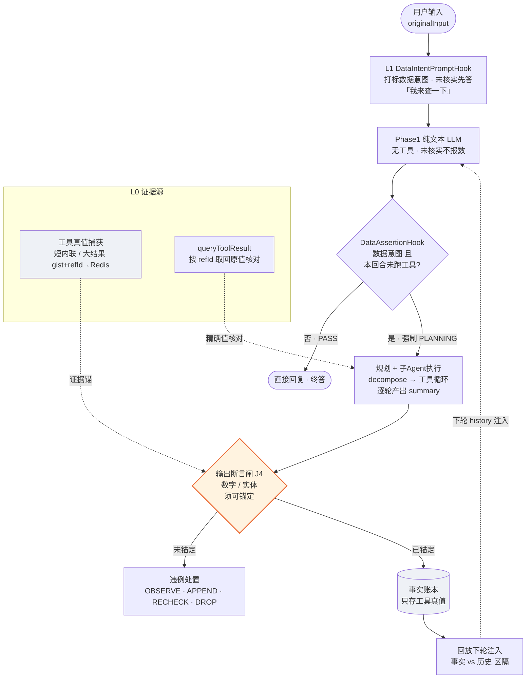

# Agent 反编造机制（诚实作答）设计文档

> 版本：v0.1（2026-09-05 设计稿）｜状态：**已评审，待分阶段实施（P0→P1→P2）**；当前仅本文档，未落任何业务代码
> 对应模块：后端 `picknear/picknear`（com.hmdp.agent）｜Spring Boot 3.4.4 / Java 17 / Spring AI 1.1.2（qwen-plus）
> 前置相关：`上下文压缩子系统设计文档.md`（记忆/保真体系，本设计的 L4 与其协作）；`Agent评测设计文档.md`（确定性断言 + 离线比对风格，L3/L4 沿用）
> 交互记录：设计源于 2026-09-05 排查"AI 编造数据 / 遗忘前文"问题；用户提出**工具大结果引用式存档（refId + 取回工具）**，已吸收进 L0
> 设计约束：**解耦 + 结构化**——策略模式、单一职责、端口-适配器、瘦编排、值对象、禁布尔透传、可外置方法一律外置。**机制性纠偏优先于改 prompt**（prompt 纪律只是其中一层）。**确定性/程序化手段为主，LLM judge 只做辅助或演进**。一切新闸 **fail-open，默认只观测（OBSERVE）**。

---

## 0. 拍板点（与用户对齐，正文据此解读）

- **问题定性**：不是"AI 不知道时间"这类单点，而是**系统性幻觉/编造不存在的数据**——AI 在系统未查证时，一本正经声称存在某实体/某数字/已做过某事。
- **用户确认的编造谱系**（按优先级）：
  1. **T1 业务数据/实体**：声称系统里有某店/博客/用户/统计数，未查证或不存在。
  2. **T2 有工具结果仍编错结论**（最扎心）：工具返回真数据，总结/聚合时仍曲解、脑补、编造与工具结果不符的结论。
  3. **T3 事实性猜测**：日期、天气、外部知识等模型无来源只能瞎猜，却给具体答案。
  4. **T4 前后矛盾硬坳**：前面对话说过/查过的事实，后面忘了另编一个应付。
- **时间问题不做专门锚定**（用户明确）：真需要就给一个 `QueryCurrentDateTimeTool`（P1），不投入专门时间注入体系。
- **工具大结果用"引用式存档"**（用户提出）：短的直接保留进上下文；**超长的用 refId 映射存档**，模型需要时调 `queryToolResult(refId)` 精确取回。**字数少 = 直接保留，字数多 = id 映射，加一个查询工具执行结果 id 的工具**。
- **L0 两级双通道 = gist 与 refId 并存、都喂给模型**（2026-09-05 用户定）：gist（压缩摘要，够模型**不回溯即忠实概述**）**和** refId（需精确数值 / 核对时按需 `queryToolResult` 细看）同时出现在上下文，**不是二选一**。
- **现有 `ToolResultCompressor` 决策已落定 = 降级为 gist 生成器**（非退役）：长结果由它产出 gist 放上下文，原值存档 + refId 供细看与校验，收敛为单一路径。
- **`ToolResultQueryTool` 前置鉴权**（2026-09-05 用户定）：复用 `@RequiredDataPermission` + `ToolPermissionAspect` 体系，新增**会话级**校验实现 `ToolResultPermissionValidator`（见 §4.1 取回工具条目）。
- **Langfuse 远程模板由本机 langfuse-cli（`lf`）更新** production label + 本地 DB，并清 Caffeine 缓存；不靠人工网页改。
- **工具执行结果不落 MySQL**（2026-09-05 讨论定）：属**可再生**数据（丢了重查即有），只 Redis + 短 TTL（约 30 分钟量级、命中续期封顶）；真正不可再生、需持久化的只有 `agent_message` 对话原文（已 MySQL）。
- **三道闸逐层收紧**（2026-09-05 用户提）：① **拦截入口** = 数据类问题禁止 Phase1 裸答（由 L1 承载：数据意图打标 + `DataAssertionHook` 强制规划 + 未核实只答"我来查一下"，含空计划诚实兜底）；② **剥夺生成** = 断言型数值不让模型生成，只允许写占位引用 `{{toolKey}}`，由代码从工具真值填（§4.4 通道一）；③ **物理丢弃** = 出现无锚假数字，整条回复作废、重发兜底文案（处置 `DROP`，§4.4 通道二）。
- **断言型数值槽填充 = 把 `DATA_SNAPSHOT` 从"抄写源"变"引用源"**（用户提）：平台统计类断言（共 N 篇/家/位/条）先收权——模型输出 `{{toolKey}}` 占位，渲染期从 toolEvidence 用 `NumericKeyDataExtractor` 抽真值填回；解析失败/查无 → 该位声明"数据未能确认"，不硬编。先开统计类，其它自由数据仍由裸数字检测兜底。
- **实施节奏**：先出本设计文档评审 → 评审通过后再按 P0 开始写码（当前仅文档）。
- 日期/天气等"事实性猜测"的最小修复是加工具 + 能力边界描述（P1），**不投入专门的时间注入体系**。

---

## 0.1 新增组件命名总表（实施与文档统一用此名，勿再引入别名）

> 对齐项目惯例（工具 = `XxxQueryTool`、校验器 = `XxxPermissionValidator`、Redis 适配 = `RedisXxxStore` + `XxxKeyFactory`）。旧拟名/草稿别名见"备注"列，均已废弃。

| 组别 | 最终名（类型） | 职责 | 备注 |
|---|---|---|---|
| L0 轮级登记 | `ToolResultCapture`（接口）+ `DefaultToolResultCapture` | 在工具调用点登记本轮真值：短结果 raw 内联 / 长结果指向 refId；begin/snapshot/end 轮级隔离 | 原拟 `ToolResultStore` 已废弃，改用本名 |
| L0 原值存档 | `ToolResultArchiveStore`（接口）+ `RedisToolResultArchiveStore`（Redis 短 TTL、命中续期封顶） | 长结果原值存取、分配 refId；只本会话可查 | 原拟 `RedisToolResultArchiver` 已废弃，改用本名 |
| 存档结构 | key-per-refId **String**：`agent:toolref:{cid}:{refId}` → JSON `ToolRefEntry{toolName, userId, raw, createdAt}`；TTL 默认 ~30min、命中续期封顶 | 不用 Hash（Hash 只能整体 TTL，无法表达单条 HIT/EXPIRED 与逐条续期）；值内 userId 双保险归属 | refId = 服务端 12 位小写 hex 随机票号，不编明文 |
| 存档 key | `ToolResultKeyFactory` | `agent:toolref:{cid}:{refId}`（复用 `ConversationMemoryKeyFactory` 风格） | 前缀不再沿用 P3 蓝图的 `agent:toolraw:*` |
| 取回工具 | `ToolResultQueryTool`（类，文件已建）· `@Tool queryToolResult(List<String> refIds)` | 模型按需细看/核对精确值；存在性 + 会话归属 | 旧拟名 `QueryToolResultTool` 已废弃，类名随已建文件 |
| 取回返回 | `ToolResultView{refId, toolName, status, raw, createdAt}` + `ToolRefStatus{HIT, EXPIRED, MISS}` | 逐条状态化返回给模型 | 草稿 `ToolResult`/`ToolResultId` 废弃；refId 即 `String`，不再单独 id 类型 |
| 证据对象 | `ToolEvidence{toolName, refId?, gist?, raw?}`，挂在 `ExecutionOutput.toolEvidence` | L3 断言锚 | 不变 |
| gist 生成 | 现 `ToolResultCompressor`（降级为 gist 生成器） | 长结果压缩出 gist 放上下文 | 不加新类 |
| 取回鉴权 | `ToolResultPermissionValidator implements DataPermissionValidator`（`resource="tool-result"`，label="工具执行结果"）+ `SessionScopedValidator`（可选接口：`validateScoped(userId, conversationId, action)`，供切面会话级扩展） | 前置鉴权：refId 归属当前会话/用户且未过期 | 原拟 `ToolResultAccessValidator` 已废弃，改用本名并对齐 `BlogPermissionValidator` 系列 |
| 输入侧 | `DataIntentClassifier` · `DataIntentPromptHook` · `DataAssertionHook` · `DataIntentEmptyPlanFallback` | L1 路由/兜底 | 不变 |
| L3 槽填充 | `AssertionSlotTokenizer`（解析/校验 summary 中的 `{{toolKey}}`）+ `AssertionSlotRenderer`（从 toolEvidence 填真值，抽数复用 `NumericKeyDataExtractor`） | 剥夺生成·统计类断言先开；解析失败 →"数据未能确认"、不硬编 | 新增（§4.4 通道一） |
| 输出闸 | `ClaimExtractor`(+`NumericClaimExtractor`) · `EvidenceAnchorer` · `EvidenceAssertionGate` · `HonorAction`（OFF/OBSERVE/APPEND_DISCLAIMER/RECHECK/**DROP**）· `EvidenceViolationHandler` | L3 | `DROP`=物理丢弃（整条作废重发兜底文案） |
| L4 账本 | `FactLedgerStore`（接口）/`RedisFactLedgerStore`（实现），key `agent:conv:{cid}:ledger` | 只存工具真值 | 不变 |
| 取回依赖 | 工具方法不新建 Service，读写统一走 `ToolResultArchiveStore` | — | 草稿虚构 `ToolresultService` 废弃 |

---

## 1. 背景与目标

Agent 有大量"编造"投诉，且现有防线以 prompt 喊话为主、无强制力。观察到的共性：

| 现象 | 本质 |
|---|---|
| 问"今天几号"，AI 编一个日期 | 无时钟工具、无时间锚 → 只能从训练参数猜 |
| 问"平台有多少家店"，AI 直接报数 | Phase1 无工具，数据问题又可能不进规划 → 编造成为终答 |
| 工具返回了数据，总结仍编出第 6 家店 | 无"结论必须忠实于工具结果"的校验 → 编错结论无感通过 |
| 前轮说的事实，后轮忘掉另编 | 记忆只存 user/assistant 文本、摘要化丢语义 → 遗忘后只能硬坳 |

目标：
- **机制性**：让"无证据的断言"在系统层面过不了闸，而不是只靠模型自觉。
- **保真可追溯**：工具真值可寻址（原文/refId），输出断言可程序化比对。
- **分层交付**：P0 掐 T1+T2 → P1 补 T3、拓宽 T2 → P2 深度演进，各自独立可发布。
- **低风险**：一切新闸 fail-open，默认 OBSERVE 只观测校准，再放开处置。

---

## 2. 现状诊断（已核实）

### 2.1 结构性根因

**模型唯一合法的数据通道是工具，但代码从未把"工具真值"与"模型说出口的内容"做程序化比对。** Prompt 喊话只是软约束，一旦 LLM 在聚合/总结时脑补（T2），没有任何机制拦得住。

### 2.2 关键断链点

| 事实 | 位置 |
|---|---|
| **Phase1 不绑任何工具**：`chatModel.stream(streamPrompt)` 只发 messages、无 ToolCallback；却要求"业务数据依托工具查询"（物理做不到） | `stream/StreamingChatInvoker`（assembleBase `[System]+history`，重试循环外固定）；`AiServiceImpl`（异步段 render SYSTEM_MAIN + recentMessages） |
| **系统提示词无任何时间锚、无"查当前日期"工具**；`{{currentTime}}` 只在 Javadoc 示例，未注册；实际生效占位符仅 `userId`（+各 Prompt 内部变量） | `resources/prompts/*.txt`；`prompt/placeholder/*`（registry 无生产调用方）；`AiServiceImpl` `systemVars(userId)` |
| **数据直问大概率不进工具链**：转 Phase2 靠 `TaskTriggerHook` 触发词（对比/总结/分析/统计/归纳/报告/比较/差异/变化/趋势/分别/查/查询/天气/看看/找一下），缺"多少/几家/销量/评分/我的X/作者是谁/几号/星期几" | `hook/impl/TaskTriggerHook`；唯一 `AfterAiHook` 实现 |
| **编造首答已流出才路由**：Phase1 逐 token 推给用户后才跑 AfterAiHook；PASS 则回复即终答，PLANNING 才进规划 | `SseResponseProcessor` → `AiResponseRouter` |
| **空计划绕过**：`MultiRoundOrchestrator` `tasks.isEmpty() → return currentResponse`，Phase1 编造文本原样放行 | `orchestration/MultiRoundOrchestrator`（runLoopWithHistory 内） |
| **无真值锚**：`DATA_SNAPSHOT` 是**模型自转写**（`ResultParser` 只解析不校验来源）；工具原始返回仅在 `AbstractToolLoop.invokeToolAndRecord` 短暂存在即消失 | `subagent` 工具循环；`ResultParser`/`ExecutionOutput` |
| **记忆固话编造**：agent_message 只存 user/assistant 文本，assistant 谎话被原样回放；压缩 `FidelityAssurance` 连 assistant 谎话数字也做关键数据回填 = 固化谎言 | `history/ConversationReplayServiceImpl`、`history/fidelity/*` |
| **模板改动在 Langfuse 不生效**：取词优先级 远程 Langfuse → 本地 DB → 内置 txt；只改仓库 txt 无效 | `prompt/DefaultPromptService`、`repo/LangfusePromptRepository` |
| 天气是硬编码 mock；工具 description 无"诚实契约"（查不到/边界全靠子 Agent 提示词翻译） | `tool/impl/*`、`resources/prompts/agent.tool.*.txt` |

### 2.3 已有可复用资产

- `system.main`【诚实作答】：业务数据必须依托工具、查不到如实说、绝不瞎编（软约束，文本已有）。
- `subagent.execution` 第 5 条"不要编造工具没有返回的数据"+ 强制 JSON `DATA_SNAPSHOT` 快照（模型自转写，不可当锚）。
- 规划 v2 参数约束："参数值从用户问题中提取，不得编造"、"禁止 self/me/我的 占位符"；`plan.support.UserIdPlaceholderResolver` 两层兜底。
- `ToolIntentTree.NODE_DEFS` + `@ToolMeta` 关键词（可聚合出输入侧词表，不重复维护）。
- P3 蓝图 `agent:toolraw:*` 原值存档思路（未实现，`LlmCompressor` 仍是 TODO 桩降级截断）——引用式存档可复用此思路。
- Hook 链（`PromptHookChain`/`AfterAiHookChain`/`HookResult`）、`AgentContext.attributes`、观测 `AgentSpan`/`AgentField`/`AgentTracer`、`ConversationMemoryStore` key 工厂。

---

## 3. 核心判断与总体架构

**主轴：在工具执行点捕获真值快照 → 每轮最终文本离开子 Agent 前做确定性断言 → 无证据的断言走可配置处置（默认只观测）。**



| 层 | 职责 | 主治 |
|---|---|---|
| **L0 证据源** | 捕获工具真值、大结果引用式存档（refId + gist + 取回工具）；`ExecutionOutput` 携带证据 | 一切层的锚 |
| **L1 输入侧** | 数据意图预检强制进工具规划；空计划诚实兜底；seed 清洗 | T1（"根本没查"分支） |
| **L2 Prompt 纪律** | 能力边界 + 未核实不答 + 引用即快照 + 历史非事实（软层） | 四类 |
| **L3 输出断言闸** | 每轮 summary 的数字/量词/实体断言锚定，未锚定走处置 | T1/T2 主案 |
| **L4 记忆防固话** | 事实账本只存工具真值；回放区隔"事实/历史"；压缩保真源修正 | T4 |

---

## 4. 模块详设

### 4.1 L0 · 证据源层（先做，所有层的锚）

采用**结果引用式存档 + 两级双通道**：大结果不全量进上下文，gist 摘要与 refId 并存都喂给模型（见下）；短结果仍原文直给。

1. **工具真值捕获 + 分级**：在 `AbstractToolLoop.invokeToolAndRecord(...)`（serial/parallel/DAG 三策略统一调用点，已核实）拦截工具真实返回，按长度分诊：
   - **短结果（≤ 阈值，如现 `agent.prompt-guard.tool-result.max-chars=1200` 内）**：直接进上下文原文（模型所见即真值），同时登记进轮级 `ToolResultCapture`。
   - **大结果（> 阈值）**：**不截断、不丢**——原值存存档（复用 P3 `agent:toolraw:*` 思路：`RedisToolResultArchiveStore`，Redis + 短 TTL），分配 **refId**；上下文里**同时放入 gist 与 refId**：gist 由 `ToolResultCompressor`（降级为 gist 生成器，见点 5）产出，模型读 gist 即可忠实概述、**无需回看**；该段末尾标注 `【已归档 → 引用精确值/核对可调 queryToolResult({refId})】`，需要细看时再按需取回。
2. **取回工具 `ToolResultQueryTool`**（`tool/impl/`，`@TargetTool(active=true)` 自动注册，**并入 P0**）：
   - 入参 `refId`；**只读、仅本会话/本回合、只能查自己产生的结果**（防越权）。
   - **存在性校验**：查无 id → 返回"无效引用 / 结果已过期"，**绝不顺着模型编**。
   - **前置鉴权（复用现有 AOP，2026-09-05 用户定）**：`ToolPermissionAspect` 现按"方法参数中第一个 Long/Integer 作 targetId"路由校验器，而取回参数是 `List<ToolResultId>`（字符串 refId）→ 现切面会因无标量 targetId **直接放行**，到不了自定义校验器。落地两条：
     1. 新增 `ToolResultPermissionValidator implements DataPermissionValidator`（`@Component`，`resource="tool-result"`，label="工具执行结果"）：`validate` 语义 = 该 refId 存档元数据（conversationId/userId/createdAt/TTL）**归属当前会话与用户且未过期**。`PermissionValidatorFactory` 启动自动收集，**零修改**。
     2. `ToolPermissionAspect` 一处**向后兼容**扩展：抽可选接口 `SessionScopedValidator`（`validateScoped(Long userId, String conversationId, DataAction action)`）；切面在 `targetId == null` 且 validator 实现该接口时，改以 `ToolContext` 里的 userId/conversationId 走会话级校验，不再直接放行；原 Long-targetId 路径（blog/user 等）行为不变，回归面最小。
     3. 鉴权失败返回与 guard BLOCK 一致的 `{"error":"无权查看该工具执行结果"}`，LLM 按错误转述自纠；**fail-open**：会话级校验器缺失/异常 → 放行 + log.warn（只读操作，宁可放行不阻断主链）。
3. **两级呈现纪律（prompt，防"没看数据也总结"的坑）**：大结果 gist 必须留在上下文（模型能理解才能忠实概述）；**refId 只用于报精确数值 / 核对引用时按需拉取**；凡 summary 出现的大结果精确数字，要求先经 `queryToolResult` 核对。
4. **ExecutionOutput 携带证据**：`toolEvidence: List<ToolEvidence>`，`ToolEvidence{toolName, refId?, gist?, raw?}`（raw 仅短结果内联、大结果指向 refId）。`ToolExecutionFacade.execute` 成功路径从 store 取快照回填；`RetryRunner` begin/end 保证轮级隔离。**输出闸（L3）锚定 `refId → 原文` / 内联 raw**。
5. **与现有压缩链的关系（决策已落定 = 降级为 gist 生成器）**：`ToolResultCompressor`（>80 走 LLM 摘要 + 保真回填）**不退役**，降级为 **gist 生成器**——压缩输出即 gist（进上下文，够模型不回溯即概述）；存档 = 原值、精确核对 = refId。单一路径收敛，避免两套机制各自丢数。
6. **引用即快照纪律（prompt）**：子 Agent 总结对关键数字标注来源工具名或 refId；`DATA_SNAPSHOT` 只准抄工具返回/gist，不得新增字段。
7. **存储介质判定**：工具执行结果属**可再生**数据（Redis flush 后重查即有），**不落 MySQL**；Redis + 短 TTL（约 30 分钟量级，命中续期封顶防永不回收）。不可再生、需长期保留的只有 `agent_message` 对话原文（已 MySQL 持久化）。
8. **refId 与存档结构（2026-09-05 定）**：
   - **refId**：服务端生成的 **12 位小写 hex** 随机"票号"（如 `a3f90c2b71de`），**不编码** cid/toolName/userId——避免模型拿到带 key 语义的串产生探测空间；仅在大结果存档点分配。格式白名单 `^[a-f0-9]{12}$` 挡注入。
   - **Redis 用 key-per-refId 的 String 结构，非 Hash**：`agent:toolref:{cid}:{refId}` → JSON `ToolRefEntry{toolName, userId, raw, createdAt}`。cid 作命名空间 ⇒ 会话隔离（跨会话 key 不在前缀下，一律 MISS 且不区分"不存在/别人的"）；userId 放值里做双保险归属校验。
   - **TTL**：默认 ~30min；命中续期但**封顶**——`newTtl = min(remain + window, cap)`，防永不回收。
   - **批量**：`MGET` 取回多条 + pipeline 补 `EXPIRE`。
   - 选 String 而非 Hash 的理由：Hash 只能整体 EXPIRE ⇒ 续命全续、过期一片，无法表达单条 HIT/EXPIRED 与逐条续期——而单条过期语义恰是取回工具的核心。

### 4.2 L1 · 输入侧（治 T1"根本没查"分支）

1. **`DataIntentClassifier`（纯函数，不调 LLM）**：`originalInput → DataIntent`。枚举建议 `{PLATFORM_STATS, SHOP, BLOG, USER, VOUCHER, WEATHER, CLOCK, MY_ENTITY, NONE}`。词表**聚合 `ToolIntentTree.NODE_DEFS` + `@ToolMeta` 关键词**（不重复维护），并补齐现有触发词缺口：
   - 计数/聚合：`多少、几家、多少个、总量、共计、一共、销量、评分、人气、排名、排行、最高、最多、Top`、量词实体 `N篇博客/N家店/N个用户/N条评论`；
   - 我的实体：`我的博客、我发的、我关注、我的订单、我的券、我买过`；
   - 身份事实：`作者是谁、是哪家、叫什么、老板`；
   - 时钟：`几号、今天几号、现在几点、星期几、日期`。
2. **`DataIntentPromptHook implements PromptHook`**：输入侧打标 `AgentContext.ATTR_DATA_INTENT`（attributes，不加字段）；命中数据意图但**无工具可查**（意图树命中空）时，以 REPLACE 向 `currentInput` 注入指令行："【数据类问题：未通过工具核实前不得给出数字/具体事实，应先回答"我来查一下"。】"
3. **Phase1 兜底话术（system.main，见 §5）**：即使漏判，Phase1 也只答"我来查一下"，不报数。
4. **`DataAssertionHook implements AfterAiHook`（漏判兜底）**：数据意图标记存在 **或** 输入命中数据词表，且本回合未跑工具 → 返回 `HookResult.planningRequired()` 强制 PLANNING，**不看 Phase1 是否已自答**。与 TaskTriggerHook 的 PLANNING 传染聚合幂等兼容。
5. **空计划诚实兜底 `DataIntentEmptyPlanFallback`**：`MultiRoundOrchestrator` `tasks.isEmpty()` 分支，当 ctx 带数据意图标记时**不得 return 可能含编造的 currentResponse**，改返回诚实兜底文本（如"我暂时没有查询到相关数据，请换个问法或稍后再试"）。
6. **seed 清洗 `ATTR_PLAN_SEED_OVERRIDE`**：`AiResponseRouter` PLANNING 分支读取该属性，有则用中性占位（"（数据查询任务，请基于工具结果作答）"）替换传给 `TaskPlanner.submit` 的 `aiResponse`——避免 Phase1 若已编数字，假话继续进 planner 的 `currentResponse` 上下文诱导子 Agent。

### 4.3 L2 · Prompt 纪律增强（软层；改后须同步 Langfuse production + 本地 DB + 清缓存）

见 §5 模板改动表。

### 4.4 L3 · 输出侧：剥夺生成 + 确定性断言闸（治 T1/T2 主案）

L3 由**两个串行通道**构成：先**剥夺生成**（高危断言不让模型写数字，只准写占位、由代码填真值）→ 再**确定性断言闸**（对仍留在自由文本里的裸数字做锚定，未锚定走处置，最高到物理丢弃）。

**通道一 · 剥夺生成（断言型数值槽填充，2026-09-05 用户定，先开"平台统计类"）**
- 平台统计断言（"共 N 篇/家/位/条/个用户"）在子 Agent 最终输出中**不得直接写数**，只能写占位 token `{{toolKey}}`（如 `{{queryTotalShops}}`）——把 `DATA_SNAPSHOT` 从"供模型抄写的底稿"改为"供模型点选的目录"，数字由代码写、不经模型采样。
- 渲染：`AssertionSlotTokenizer` 解析 summary 全部 `{{toolKey}}` 并校验 toolKey 确实存在于本轮 `toolEvidence`（防编造槽名）→ `AssertionSlotRenderer` 从该工具真值用 `NumericKeyDataExtractor` 抽出数字填回。
- 槽解析失败 / toolKey 无 evidence / 抽不到数字 → **不渲染**，该位声明"该项数据未能确认"，绝不硬编占位。
- 先只对统计类收权；店铺/列表等自由数据暂不槽化（演进可扩字段级槽 schema），仍由通道二兜底。

**通道二 · 确定性断言闸（Gate）**

- **植入点 J4**：`RoundExecutionProxy.executeRound` 中 `toolExecutionFacade.execute(session)` 返回后、`historyAggregator.recordHistory` 之前——每轮子 Agent 最终自然语言产出的唯一咽喉（子 Agent 与回退两路径的 summary 均经此回编排层）。
- 组件（全部确定性/程序化，不用 LLM 当主防线）：

```java
// 提取 summary 中"可断言 token"（纯解析）
public interface ClaimExtractor { List<Claim> extract(String text); }
// 默认 NumericClaimExtractor：数字+量词(篇/家/位/个/条/元/分/%)、实体 ID 引用(如 ID 3 / #3)
public record Claim(String raw, ClaimKind kind, String token) {}

// 锚定：token 是否落在 证据∪用户原话∪事实账本∪白名单 内
public interface EvidenceAnchorer { Anchored anchored(Claim c, EvidenceAnchor ctx); }
// EvidenceAnchor = { toolEvidence文本, userInput, ledgerText, 白名单数字, 推导白名单(数组长度 N→"N条") }

// 门（单入口，fail-open）
public class EvidenceAssertionGate {
  public String gate(String summary, EvidenceAnchor anchor, HonorConfig cfg); // 返回处置后文本
}
public enum HonorAction { OFF, OBSERVE, APPEND_DISCLAIMER, RECHECK, DROP } // DROP=物理丢弃（整条作废重发兜底），默认关
public interface EvidenceViolationHandler { String handle(...); }      // 处置策略，可外置
```

- **锚定规则（宁精勿泛，消灭主要误杀源）**：允许 = token 出现在 `toolEvidence` 原文（含 refId 指向的存档原文）/ 用户原话 / 事实账本 / 白名单（`前10/前3/Top10/页码/系统常量如 MAX_PAGE_SIZE`）/ **工具返回数组长度推导出的计数**（返回 10 家店 → 说"前 10 家"合法，从证据文本识别数组长度 N 计入白名单）。其余 = 不允。
- **两个高精度检测器**：
  - **Detector A（P0 开，治 T1）**：summary 含"共 N 篇/家/位/条"或"当前共有 N"，而本轮 `toolEvidence` **无**任何 `queryTotalBlogs/Shops/Users` → 命中（高置信窄规则）。
  - **Detector B（P1 校准后开，治 T2）**：summary 数字 token 不在锚集 → 命中（宽口径，先 OBSERVE 测误杀率）。
- **处置闭环**（`agent.honesty.assertion-gate.action`）：
  - `OBSERVE`：只记观测属性 `agent.assertion.violations` + 命中文本样例，不改回复（校准用）。
  - `APPEND_DISCLAIMER`：命中在 summary 末尾附"（注：以上部分数据未能从本次查询结果核实，请以实际为准）"，不重答。
  - `RECHECK`（P1 后，Detector B）：带"只准引用以下工具数据、删去未出现内容"的 strict rewrite prompt 重答一次（复用 `chatModel`），`max-recheck=1` 硬顶，仍命中降级 APPEND。**辅助非主防线，默认关**。
  - `DROP`（物理丢弃，2026-09-05 用户提，校准后开）：命中无锚假数字 → **整条回复作废**，重发兜底文案（如"抱歉，该项数据我暂时无法核实，已停止作答"）。仅建议对高置信 Detector A 与槽渲染失败场景启用；防误杀校准期默认关。
- **fail-open 契约**：gate 内任何异常 → 记日志、原样返回 summary、只升 OBSERVE 指标。不阻断主链、不影响 CONFIRM/DAG/快照恢复路径（CONFIRM 在工具层抛出到不了 J4；DAG 证据经同一 invokeToolAndRecord 一致；快照恢复 resumePlan 重走 runLoopWithHistory → 同一 gate，异常安全）。

### 4.5 L4 · 记忆防固话（治 T4）

1. **事实账本 `FactLedgerStore`（接口）+ `RedisFactLedgerStore`（实现）**：有工具成功执行的回合结束（J7，recordTurn/round 之后）把 `toolEvidence` 压缩成账本行（工具名+关键值，如 `queryShopById: 茶颜悦色 人均35 评分4.8`），按 conversation 追加存 Redis（复用 `ConversationMemoryStore` key 工厂，新前缀如 `agent:conv:{cid}:ledger`）。**只存工具真值，绝不存 assistant 编造文本**。
2. **回放区隔事实/历史**：`ConversationReplayServiceImpl.recentMessages` 组装消息时：
   - 账本非空 → 头部注入 `SystemMessage("【已核实事实】...（仅下列条目可当作事实引用；其余一律视为未核实）")`；
   - 回放尾部原文前注入 `SystemMessage("以下为历史对话原文，仅供理解上下文，不代表事实；涉及数据的表述须重新核实")`——让模型区分"可引用"与"仅上下文"，缓解上一轮谎话被回放加固。
3. **压缩保真方向修正**：`FidelityAssurance`/`KeyDataExtractor` 改为**只从 user 行 + 事实账本**提取关键数据回填，assistant 行的数字不进摘要回填（原值仍在 agent_message 可查，不丢信息）；`SummarizePromptComposer` 注入账本做摘要锚。
4. **跨轮硬坳的兜底**：每轮输出闸锚集天然含"本轮证据∪账本"。若某轮 summary 引用上一轮事实但账本没有（上轮纯编造没查），Detector B 会在本轮拦截——T4 的程序化兜底。

---

## 5. 关键改动模板清单（改后必须三处同步 + 清缓存）

> **Langfuse 覆盖警示**：`DefaultPromptService` 取词优先级 远程 Langfuse(production) → 本地 DB → 内置 txt。只改仓库 `resources/prompts/*.txt` **不生效**——必须同步推送/编辑 Langfuse production label + 本地 DB，并走 `PromptAdminController`/`PromptCacheWarmer` 清 Caffeine 缓存。评审与发布时把"模板 diff 已同步远程"列为检查项。

| 模板 | 改动要点 | 治哪类 |
|---|---|---|
| `agent.system.main` | 新增【能力边界】清单（日期/天气数值/他人隐私/非平台数据不可知）；【数据作答纪律】：数据问题必须先查工具、未核实只答"我来查一下"、绝不报统计数；明确"上一轮说过的不代表事实，本轮需重新核实" | T1/T3/T4 |
| `agent.system.subagent` | **补缺口**："不得编造工具未返回的数据；每个关键数字必须能对应到某个工具返回；工具返回不含的内容（温度/比率/排名）不得补充具体值；做不到就明说" | T2/T3 |
| `agent.prompt.subagent.execution` | 保留第 5 条并升级"引用即快照"：关键数字标来源工具名/refId；DATA_SNAPSHOT 只抄返回、禁新增字段 | T2 |
| `agent.prompt.task.merge` | 加："只能依据下方 contextSummary 列出的工具数据作答，不得补充工具未返回的数字或结论" | T2（回退路径） |
| `agent.system.planner` | 可不动（空计划拦截在代码层 L1.5 做） | — |
| `agent.tool.*`（stats/weather） | 补能力边界：stats 注明"只返回全量总数，不含分维度拆分"；weather 注明"当前仅支持天气状态描述，不返回温度湿度等数值" | T1/T3 |
| `agent.tool.queryToolResult.txt`（P0 新增） | 取回工具描述 + 安全约束（只读/限会话/限自己/鉴权失败即"无权"、查无即"无效引用"） | T2（引用核对） |
| `agent.tool.queryCurrentDateTime.txt`（P1 新增） | 时钟工具描述 | T3 |

---

## 6. 配置项（前缀 `agent.honesty.*`）

```yaml
agent:
  honesty:
    data-intent:
      enabled: true                  # 输入侧数据意图预检
    assertion-gate:
      action: OBSERVE                # OFF | OBSERVE | APPEND_DISCLAIMER | RECHECK
      max-recheck: 1                 # RECHECK 重答次数硬顶
      whitelist-numbers: "前10,前3,Top10"
    ledger:
      enabled: true
      max-chars: 2000                # 账本注入上限
    tool-ref:
      enabled: true                  # 大结果引用式存档（L0）
      ttl: 24h
      threshold-chars: 1200          # 超过此长度走 refId 存档（默认对齐现 maxResultChars）
```

复用现有开关（不改语义）：`feature.subagent.enabled`、`feature.tool-routing.enabled`、`agent.prompt.repository.type`、`hmdp.prompt-guard.tool-result.max-chars`、`hmdp.ai-observability.*`。

---

## 7. 分阶段路线（各自独立可发布）

- **P0（推荐立即做，治 T1+T2 最小闭环）**
  1. L0 证据源：`ToolResultCapture` + `ExecutionOutput.toolEvidence`；短结果内联登记；**大结果 gist+refId 双通道**（`ToolResultCompressor` 降级产 gist → Redis 存档 + `ToolResultQueryTool` 取回，含 AOP 会话级鉴权 `ToolResultPermissionValidator`）。
  2. L1 输入侧：`DataIntentClassifier` + `DataIntentPromptHook`（打标）+ `DataAssertionHook`（强制规划）+ 空计划诚实兜底 + `ATTR_PLAN_SEED_OVERRIDE` seed 清洗。
  3. L3 Detector A（默认 `OBSERVE`，命中可开 `APPEND_DISCLAIMER`）。
  4. L4 账本基础版 + 回放两条 SystemMessage 区隔。
  5. 模板改 4 个 txt（含新增 queryToolResult 模板），用本机 langfuse-cli（`lf`）同步 Langfuse production + 本地 DB，走 `PromptAdminController`/`PromptCacheWarmer` 清 Caffeine 缓存。
  → 独立可发布；风险面小（全 fail-open，默认只观测）。
- **P1（补 T3 + 拓宽 T2 + 剥夺生成）**：`QueryCurrentDateTimeTool` + weather/stats 工具能力边界；**断言型数值槽填充（统计类先开）**：`AssertionSlotTokenizer`/`AssertionSlotRenderer` + 占位纪律写进 subagent.execution / task.merge 模板；Detector B（OBSERVE 校准后开）+ 处置 `RECHECK`、**`DROP`（物理丢弃 · 整条作废重发兜底）**；账本注入 planner/子 Agent seed；压缩 keyData 源改 user+账本（T4 加固完整）；Langfuse Dataset 回归集沉淀。
- **P2（演进，防误杀优先）**：句子级 STRIP 处置（按命中的句子划除，需句切分）；实体名锚定（工具返回的实体 ID/名称做名词白名单）；回退路径 `LLM_REASON`/merge 输出闸；本地 DB 模板自动同步；可选 LLM 自检作辅助（feature 开关，非主防线）。

**推荐：先按 P0 落地并 OBSERVE 校准一段时间，再进 P1。**

---

## 8. 验证与评测（确定性断言风格，对齐现有评测文档）

| 层 | 可确定性单测的断言 |
|---|---|
| 输入侧 | `DataIntentClassifier` 词表命中表（正/反例：命中"一共多少用户"、不命中"你好/推荐个餐厅"）；`DataAssertionHook`：数据意图+空回复/无数字回复 → PLANNING、闲聊 → PASS |
| 证据源 | mock DB 返回 N → `ExecutionOutput.toolEvidence` 含 N；三策略（serial/parallel/DAG）均收集；CONFIRM 不产生 evidence；大结果 → gist 进上下文 + refId 可 `queryToolResult` 取回原文（内容一致） |
| 输出闸 | Detector A：summary"当前共有 12345 位用户"且本轮无 stats → 命中；有 `queryTotalUsers` 且证据含 12345 → 不命中；数组长度推导（10 家店→"前 10 家"）→ 不命中；用户原话数字复述 → 不命中；Detector B（P1 开）：summary"人均 88"但证据无此数 → 命中 |
| 处置 | APPEND_DISCLAIMER 追加文案单测；RECHECK 命中→重写一次→仍命中降级、maxRecheck 封顶断言；gate 抛异常 → 原样返回 + 只升指标 |
| 取回鉴权 | `ToolResultPermissionValidator`：本会话/本人 refId → 放行；他会话/他人 → 拒绝 + errorJson；过期/查无 → 拒绝；会话级校验器缺失 → fail-open 放行；`SessionScopedValidator` 切面扩展对既有 blog/user Long-targetId 路径零影响 |
| 记忆 | 账本写入条件（成功回合有、纯闲聊无）；回放注入"已核实事实/历史仅上下文"两条 SystemMessage 断言；FidelityAssurance：assistant 编造数字**不**进入摘要回填、账本数字**进入** |

剥夺生成 / 物理丢弃的附加断言：
- `{{queryTotalShops}}` 且 toolEvidence 有真值 → 渲染为该数（无 token 残留）；toolKey 无 evidence / 抽不到数 → 不渲染并声明「数据未能确认」；
- 未槽化的统计断言（模型直接写数）仍被 Detector A 命中；`DROP` 生效时整条作废返回兜底文案，断言不流出假数。

Langfuse Dataset 端到端回归（可沉淀）：
①"咱们平台有多少店铺" → 断言最终 summary 数字 = `queryTotalShops` 真值；
②构造工具返回 5 家店、子 Agent summary 编出第 6 家 → 断言被 Detector 拦/注；
③改模板后跑同一 Dataset 对比 judge 分不降。

**留给人工/演进**：实体级语义编造（"这家店听起来像真的但不存在"）识别精度不足 → 现有 answer-quality judge 离线比对；跨轮长期一致性靠账本 + judge；天气真实温度缺失是**数据源问题（mock）**，诚实层只能保证"只允许 mock 给的状态描述"。

---

## 9. 异常矩阵与降级（fail-open 纪律）

| # | 异常 | 影响面 | 降级动作 |
|---|---|---|---|
| 1 | 分类器/词表异常 | L1 打标 | catch → 不标数据意图，走原逻辑；仅 log.warn |
| 2 | 存档写入失败（Redis） | L0 refId | 大结果退化为现有 1200 截断兜底进模型；仅 log.warn，不阻断工具调用 |
| 3 | `queryToolResult` 查无/超时/越权 | L0 取回 | 查无 →"无效引用/已过期"；越权 → `{"error":"无权…"}`；均不得据此编造（prompt 纪律 + description 写死） |
| 4 | 输出闸解析/锚定异常 | L3 | 记日志、原样返回 summary、只升 OBSERVE 指标；`action=OFF` 整闸可关 |
| 5 | AfterAiHook 顺序/误 PLANNING | L1 | 仅对带数据意图才 PLANNING；传染聚合幂等；最坏多规划一轮，maxRounds=5 兜底 |
| 6 | 空计划把数据问题答"暂无" | L1.5 | 兜底仅诚实声明；分类器与意图树对齐，无工具命中即不标意图（REPLACE 引导只对可查问题注入） |
| 7 | CONFIRM/DAG/快照恢复回归 | 全 | gate 只在子 Agent 成功路径插，CONFIRM 在工具层抛出到不了；DAG 证据一致；resume 重走同 gate 但 fail-open |
| 8 | RECHECK 死循环/成本 | L3 | max-recheck=1 硬顶 + 降级 APPEND；默认不启用 |
| 9 | Langfuse 模板不同步 | L2 | 用 `lf` CLI 同步 production + 本地 DB 并清缓存；发布检查项 |
| 10 | 槽解析 / 渲染异常 | L3 通道一 | token 不填假数：按「数据未能确认」或原样保留，只升 OBSERVE 指标；fail-open |

**铁律**：任何诚实层组件异常不得阻断请求主链、不得污染请求线程 ThreadLocal；观测与主链解耦。

---

## 10. 代码风格铁律与文档同步清单

- 类 ≤ 一个核心职责；组件间经**接口**协作；跨层依赖指向接口；禁布尔/裸参透传，用值对象（`DataIntent`、`ToolEvidence`、`EvidenceAnchor`、`Anchored`、`Claim`）。
- 新增组件包落位建议（与现有风格一致）：输入侧/输出闸可落 `hook/` + 独立 `honesty/` 子包；证据源落 `execution/evidence/`；账本落 `history/`（与 compression/fidelity 平级）。
- 每个对外端口配一个真实实现的单测；编排类配伪策略（stub）单测。
- 观测埋点沿用 `AgentSpan`/`AgentField`，新增断言观测字段 `agent.assertion.*`（sanitize 遵循 `AttributeSanitizer`）。

**实施后同步文档**：
1. `Agent模块架构设计.md`：新组件入图。
2. `README.md` §文档索引 加本文件行（本文档已登记）。
3. `上下文压缩子系统设计文档.md`：L4 保真修正（assistant 数字不进回填）落地后回写其 §9 L1 断言口径。
4. `Agent模块发展路线图.md`：反编造 P0-P2 落地状态。

---

## 附：关键植入文件（实施时核对）

- `subagent/loop/AbstractToolLoop.java`（`invokeToolAndRecord` 真值捕获点）
- `orchestration/round/RoundExecutionProxy.java`（输出断言闸 J4）
- `orchestration/MultiRoundOrchestrator.java`（`tasks.isEmpty()` 空计划分支 L1.5）
- `service/impl/AiServiceImpl.java` + `stream/StreamingChatInvoker.java` + `prompt/Phase1PromptAssembler.java`（Phase1 决策接缝）
- `hook/AfterAiHookChain.java` / `hook/PromptHookChain.java` + `hook/impl/TaskTriggerHook.java`（两个新 Hook 入链；触发词缺口对照）
- `response/AiResponseRouter.java`（PLANNING 分支 seed 清洗）
- `history/ConversationReplayServiceImpl.java` + `history/fidelity/*`（账本注入、保真修正）
- `tool/ToolCallExecutor.java` / `tool/impl/*` / `resources/prompts/agent.tool.*.txt`（工具真值返回形态、能力边界）
- `context/AgentContext.java`（ATTR 常量，不新增字段）
- `permission/validator/impl/ToolResultPermissionValidator.java`（新建，`resource="tool-result"`）+ `aspect/ToolPermissionAspect.java` 会话级扩展（取回工具前置鉴权，见 §4.1 取回条目）
- `tool/impl/ToolResultQueryTool.java`（新建草稿已铺思路）＋ `ToolresultService`/`RedisToolResultArchiveStore`（Redis 短 TTL 存档，键前缀建议 `agent:toolref:{cid}:`）
