# Agent 模块处理流程

> 本文档描述一个用户请求从输入到输出的**完整业务流程**，聚焦框架自定义组件的职责与协作关系。
> AI 模型内部推理过程不展开，SSE 传输协议与观测细节另见专项文档。

---

## 1. 全局流程概览

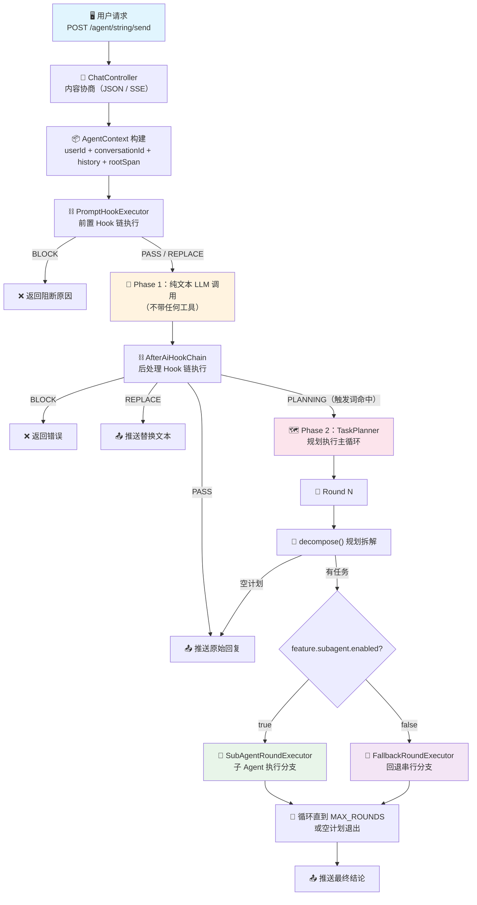

---

## 2. 请求入口：ChatController

所有请求经由 **`ChatController`**（`/agent/string/send`）统一入口，根据 `Accept` 头协商响应模式：

| 模式 | 执行方式 |
|------|----------|
| **SSE 流式（唯一对话模式）** | 异步推送，支持工具调用全流程；JSON 同步对话已废弃（2026-09-03） |

**入口动作（SSE）：**

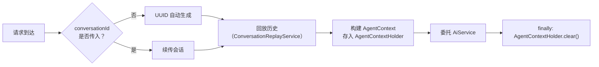

> `AgentContext` 是贯穿整个请求链路的**上下文载体**，包含 `userId`、`conversationId`、`originalInput`、`history`、`rootSpan`，通过 `AgentContextHolder`（ThreadLocal）传递，异步段由 `AgentContextPropagator` 自动传播。

---

## 3. 前置 Hook 链：PromptHookExecutor

**组件：** `PromptHookExecutor` → `PromptHookChain` → 各 Hook 实现

AI 调用**之前**执行的拦截链（SSE 对话共用）。职责：安全检测、输入清洗、敏感词脱敏（`SensitiveWordHook` 默认关闭，见源码注解与《上下文压缩子系统设计文档》§0）。

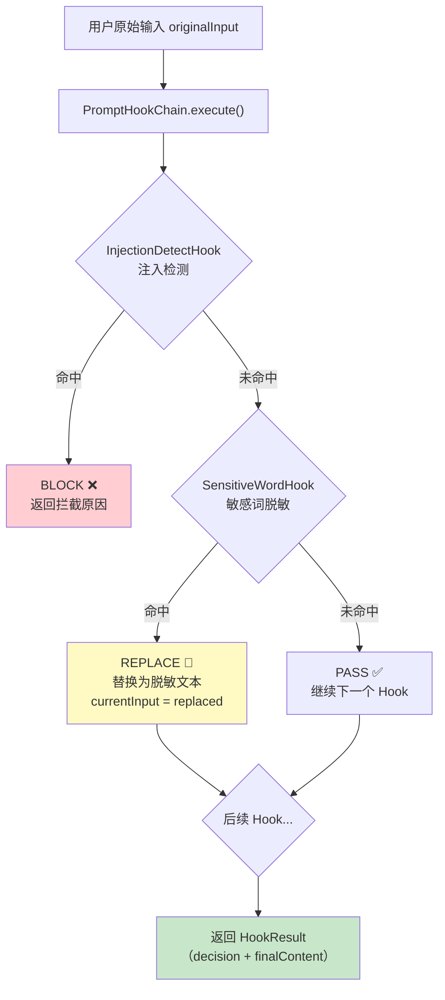

### Hook 执行规则

| 决策 | 行为 | 后续 |
|------|------|------|
| **PASS** | `currentInput` 不变 | 继续下一个 Hook |
| **REPLACE** | 替换 `currentInput`，替换结果成为后续 Hook 的输入 | 继续 |
| **BLOCK** | 立即短路，返回该 BLOCK | 后续 Hook 不再执行 |
| **异常** | Fail-Open：捕获异常，降级为 PASS | 继续 |

### 已注册 Hook

| Hook | 类型 | 职责 |
|------|------|------|
| `InjectionDetectHook` | `PromptHook` | 检测 Prompt 注入攻击特征（"忽略之前的指令"、"you are now" 等） |
| `SensitiveWordHook` | `PromptHook` | 敏感词检测并脱敏替换（"攻击银行" → "****"） |

> Hook 链输出 `HookOutcome`：未阻断时携带 `finalContent`（最终送 LLM 的文本）和 `AgentContext`；阻断时携带 `blockReason`。

---

## 4. Phase 1：纯文本 LLM 调用

**组件：** `StreamingChatInvoker`（SSE）/ `ChatClient`（JSON）

Phase 1 **不带任何工具**，AI 只做纯文本理解和初步回复。

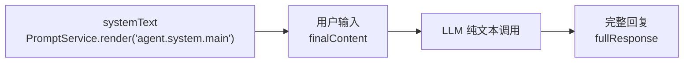

### 关键设计：为什么 Phase 1 不带工具？

| 方案 | 问题 |
|------|------|
| Phase 1 就绑定工具 | AI 第一次回复直接调工具，规划器又规划一遍 → 重复执行 |
| **Phase 1 纯文本** ✅ | 工具只在 Phase 2 执行一次，无重复，日志清晰 |

### SSE 路径的重试机制（StreamingChatInvoker）

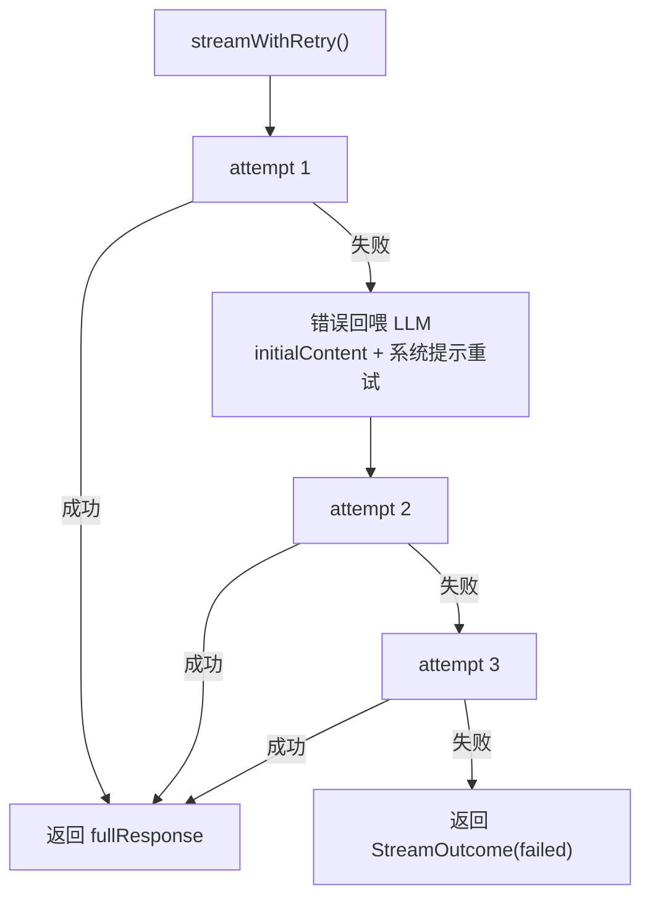

- 最多 3 次重试，失败后将错误信息回喂 LLM 让其自行修正
- SSE 模式下通过 `ChatModel` 层流式直调（绕开 `ChatClient` 层以修复断链问题）
- 每个 token 逐段推送给前端

---

## 5. 后处理 Hook 链：AfterAiHookChain

**组件：** `SseResponseProcessor` → `AfterAiHookChain` → `TaskTriggerHook`

Phase 1 LLM 回复生成后执行的决策链，决定后续路由方向。

```mermaid
flowchart TD
    A["Phase 1 回复<br/>fullResponse"] --> B["AfterAiHookChain.execute()"]
    B --> C{"TaskTriggerHook<br/>触发词检测"}
    C -->|输入含触发词<br/>且回复有效| D["PLANNING 🗺️<br/>需要拆解执行"]
    C -->|不命中| E["PASS ✅<br/>直接返回回复"]
    C -->|回复含"无法/抱歉"| E
    D --> F["聚合决策<br/>PLANNING 具有传染性"]

    style D fill:#fce4ec
    style E fill:#c8e6c9
```

### TaskTriggerHook 触发词表

```
对比、总结、分析、统计、归纳、报告、
比较、差异、变化、趋势、分别、
查、查询、天气、看看、找一下
```

**跳过条件（不进入 PLANNING）：**
- AI 回复 < 5 字
- AI 回复包含"无法"、"不能"、"抱歉"

### AfterAiHookChain 优先级短路

```
BLOCK > REPLACE > PLANNING > PASS
```

多个 Hook 返回 PLANNING 时具有**传染性**——只要一个认为需要拆解，就进 TaskPlanner。

---

## 6. 响应路由器：AiResponseRouter

**组件：** `AiResponseRouter`

根据 AfterAiHookChain 的决策结果，分发到对应处理器。

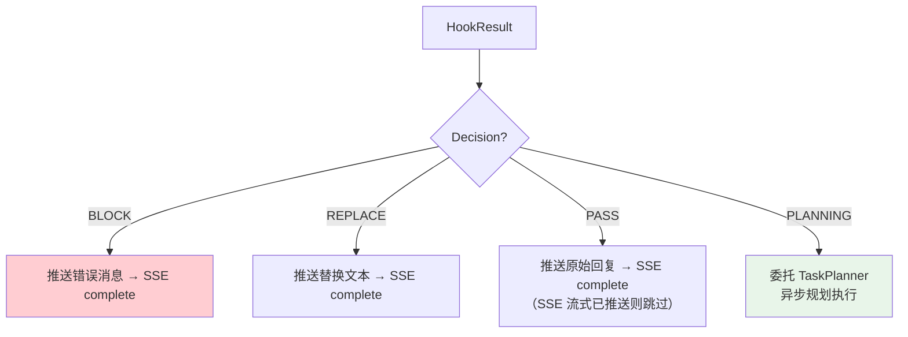

---

## 7. Phase 2：TaskPlanner 规划执行

**组件：** `TaskPlanner`（编排门面）→ `PlanLoopExecutor`（主循环）

Phase 2 是框架最核心的自定义编排层。当 AfterAiHookChain 决策为 `PLANNING` 时进入。

### 7.1 异步入口与主循环

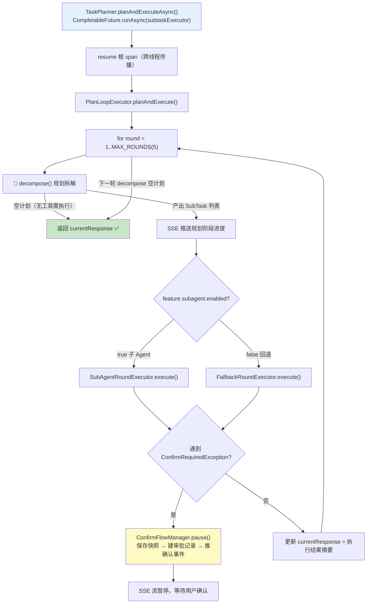

### 7.2 decompose() — 规划拆解

**组件：** `PlanRouter`（策略接口）→ `TreePlanRouter`（意图树路由）

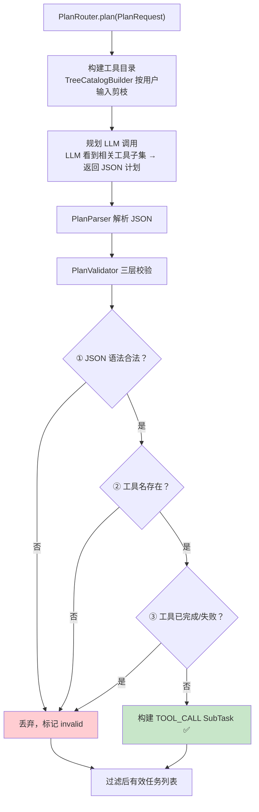

**按需加载工具提示词**（规划工具路由）：
- `ToolIntentTree`：三层次级意图树（查询/写操作 → 业务类别 → 工具叶子）
- `TreeCatalogBuilder`：按用户输入剪枝，LLM 只看到相关工具子集
- 空命中直接跳过规划（不回归全量）

### 7.3 SubTask 类型

| 类型 | 用途 | 执行方式 |
|------|------|---------|
| `TOOL_CALL` | 调用 `@Tool` 方法获取数据 | 匹配 ToolCallback → GuardedToolCallback → @Tool 方法 |
| `LLM_REASON` | 基于工具结果做聚合推理（回退路径） | 调 ChatClient 生成结论 |

---

## 8. 子 Agent 执行路径（SubAgentRoundExecutor）

**组件：** `SubAgentRoundExecutor` → `SubTaskAgent` → `SubAgentToolLoop` 策略

子 Agent 路径（`feature.subagent.enabled=true`，默认开启）是主要的工具执行路径。

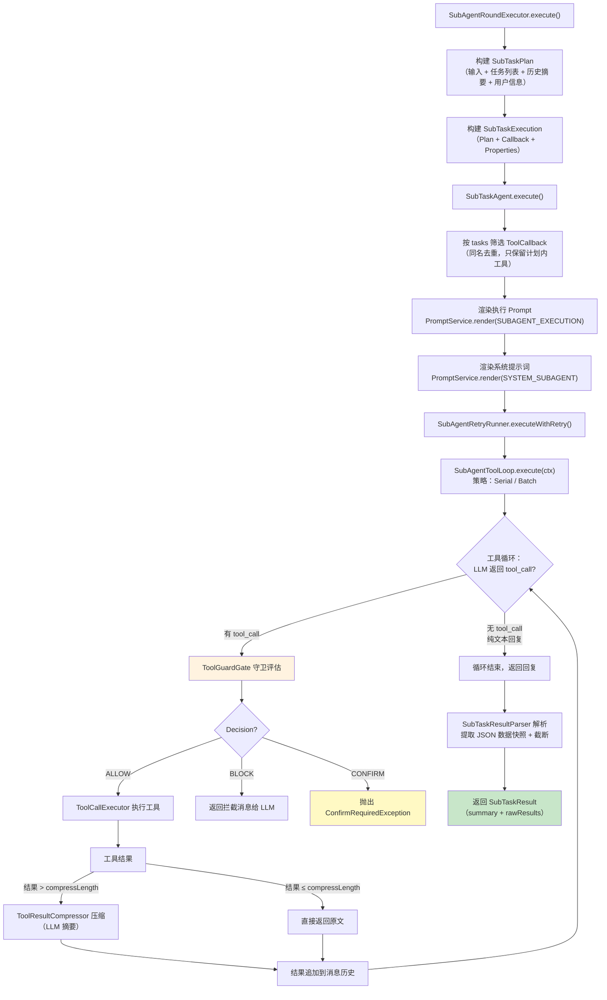

### 8.1 SubAgentToolLoop 策略

| 策略 | 配置值 | 行为 |
|------|--------|------|
| **SerialToolLoop** | `serial`（默认） | 每次只调一个工具，等待返回后再调下一个 |
| **BatchToolLoop** | `batch` | 一轮可发多个独立工具调用 + 轮内并发执行 |

**策略接口 `SubAgentToolLoop`：**
- `execute(ctx)` — 完整驱动一次子 Agent 工具循环
- `toolCallRule()` — 返回 prompt 规则文本，注入 `{{toolCallRule}}` 占位符

**每轮重渲染执行 prompt**（优化点）：
- `remaining` 缩到未执行任务
- `doneSummary` 回填已完成工具的压缩摘要
- 让每轮上下文如实反映执行进度

### 8.2 工具结果压缩（ToolResultCompressor）

当工具返回结果超过 `compressLength`（默认 80 字符）时，调用 LLM 生成摘要：

```
原始结果（2000 token） → LLM 压缩 → 摘要（~200 token）
```

短结果直接返回原文，不调用 LLM。

---

## 9. 工具调用守卫系统

**组件：** `GuardedToolCallback` → `ToolGuardGate` → `ToolGuardManager` → 各 `ToolGuardPolicy`

每次工具调用前经过守卫评估，决策为 ALLOW / BLOCK / CONFIRM。

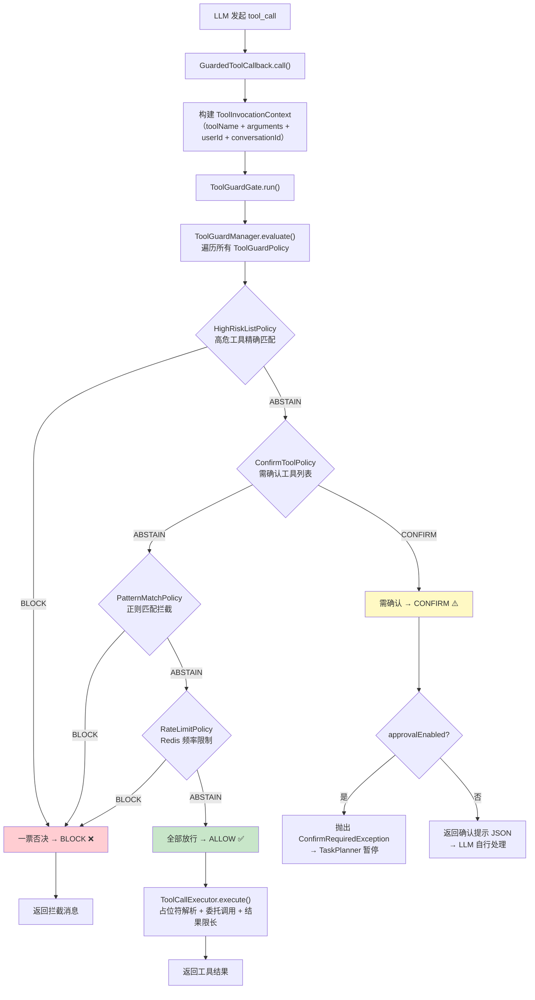

### 4 个守卫策略

| 策略 | 判断依据 | 决策 |
|------|---------|------|
| `HighRiskListPolicy` | YAML `block-tools` 精确匹配工具名 | BLOCK |
| `ConfirmToolPolicy` | YAML `confirm-tools` 精确匹配工具名 | CONFIRM |
| `PatternMatchPolicy` | 正则匹配工具名和参数 | BLOCK |
| `RateLimitPolicy` | Redis 计数器，每会话速率限制 | BLOCK |

**决策聚合规则：**
- 任一 BLOCK → 一票否决，直接 BLOCK
- 无 BLOCK，任一 CONFIRM → 需确认
- 全部 ABSTAIN / ALLOW → 放行

---

## 10. CONFIRM 审批流

**组件：** `ConfirmFlowManager` → `ApprovalService` → `ConfirmResumeService`

当守卫决策为 CONFIRM 且审批开启时，触发暂停-审批-恢复流程。

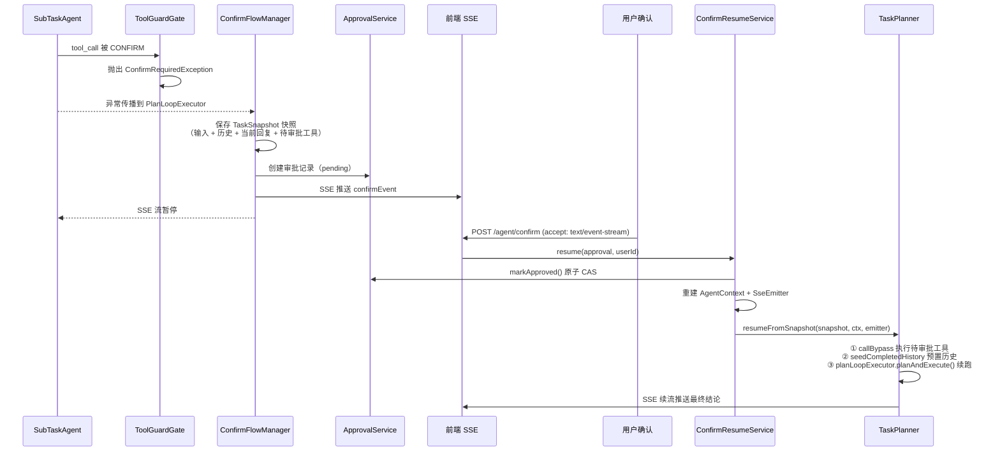

**快照内容（TaskSnapshot）：**
- `originalInput` — 原始用户输入
- `currentResponse` — 暂停前的部分回复
- `history` — 已完成的 TaskReport
- `pendingToolName` / `pendingPayload` — 待审批的工具调用
- `rootSpan` — 观测根 span（断链修复）

---

## 11. 历史记录

**组件：** `HistoryRecorder`（Phase 1 落库）/ `AgentHistoryService`（Phase 2 落库）

| 路径 | 落库时机 | 组件 |
|------|---------|------|
| JSON 模式 | AI 回复成功后 | `HistoryRecorder.recordBestEffort()` |
| SSE Phase 1（PASS/REPLACE） | AfterAiHook 决策后 | `HistoryRecorder.recordBestEffort()` |
| SSE Phase 2（PLANNING） | TaskPlanner 完成完整回合 | `AgentHistoryService.recordTurn()` |
| CONFIRM 暂停 | 不落库（回合未完成） | — |

存储介质：`ChatMemory`（JDBC 持久化，`MessageWindowChatMemory`，最近 10 轮）。

---

## 12. 组件全景图

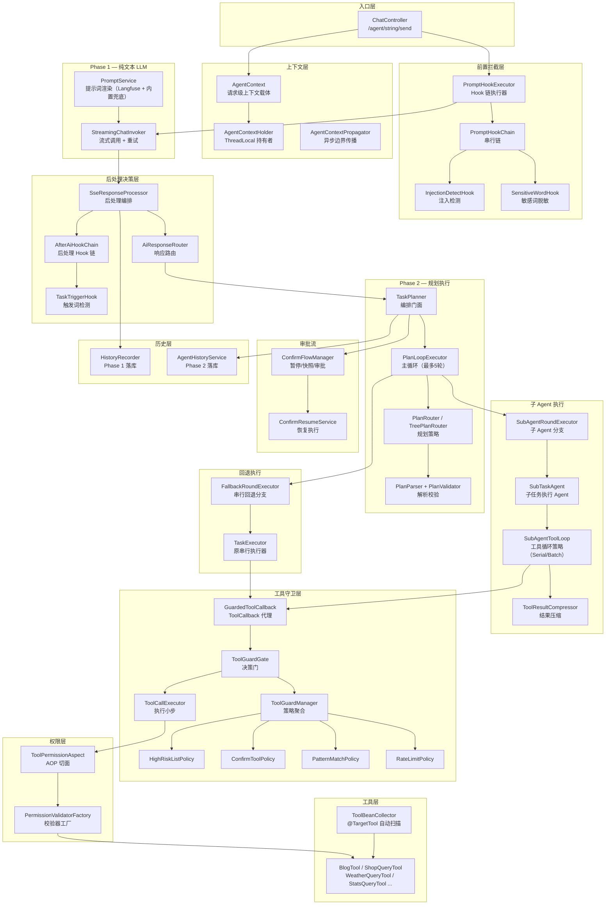

---

## 13. 端到端时序总结

以 **"查看我的博客以及长沙天气"** 为例：

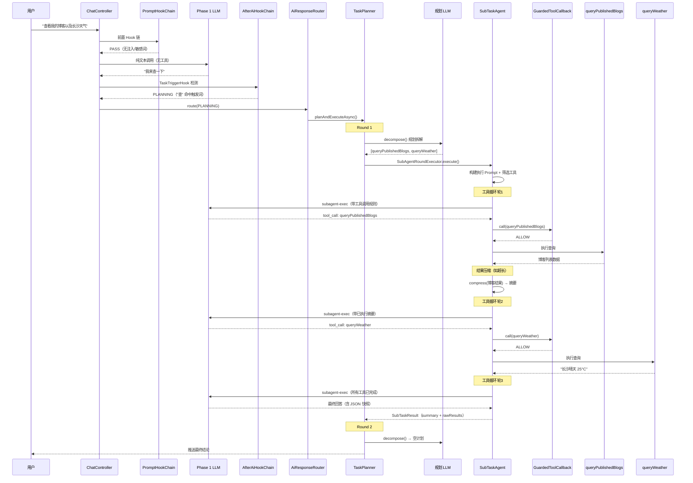

---

## 附：关键配置项

```yaml
agent:
  prompt:
    enabled: true                    # 提示词外置开关
    base-url: ${LANGFUSE_BASE_URL:}  # Langfuse 远程（空则走内置）
    cache-ttl: 5m                    # 提示词缓存 TTL

  subtask:
    tool-loop: serial                # serial（默认）/ batch
    compress-length: 80              # 工具结果超此长度触发压缩

  feature:
    subagent:
      enabled: true                  # 子 Agent 路径开关
    tool-routing:
      enabled: true                  # 规划工具路由开关（按需加载）

hmdp:
  prompt-guard:
    block-tools:                     # 高危工具拦截名单
      - deleteBlog
    confirm-tools:                   # 需确认工具名单
      - publishTestBlog
    rate-limit:
      max-per-session: 30
      window-seconds: 60
```
