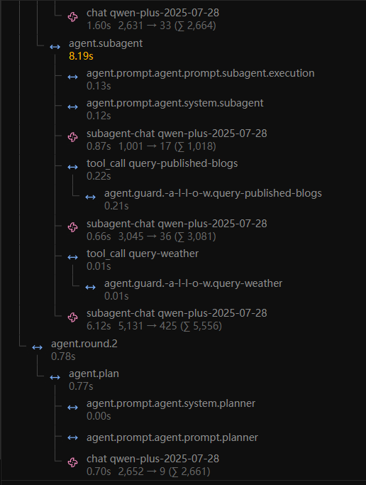

基于 langfuse 抓取调用 agent 产生的耗时记录（格式化为调用树，单位全部为秒；chat 行右侧 `N → M (∑ K)` 为 输入token → 输出token (总计)）

```
agent.session                                                  14.73s  (5 items)
├─ agent.prompt_hook                                       0.02s
├─ agent.prompt.agent.system.main                          0.76s
├─ agent.phase1                                            1.69s  (2 items)
│  ├─ chat qwen-plus-2025-07-28                          1.40s
│  └─ agent.decision                                     0.01s
├─ agent.round.1                                           11.39s  (2 items)
│  ├─ agent.plan                                         3.19s  (10 items)
│  │  ├─ agent.prompt.agent.tool.query-published-blogs 0.13s
│  │  ├─ agent.prompt.agent.tool.publish-test-blog     0.13s
│  │  ├─ agent.prompt.agent.tool.query-blogs-by-title  0.12s
│  │  ├─ agent.prompt.agent.tool.query-total-blogs     0.46s
│  │  ├─ agent.prompt.agent.tool.query-total-users     0.13s
│  │  ├─ agent.prompt.agent.tool.query-total-shops     0.12s
│  │  ├─ agent.prompt.agent.tool.query-weather         0.12s
│  │  ├─ agent.prompt.agent.system.planner             0.12s
│  │  ├─ agent.prompt.agent.prompt.planner             0.12s
│  │  └─ chat qwen-plus-2025-07-28                     1.60s  [2,631 → 33 (∑ 2,664)]
│  └─ agent.subagent                                     8.19s  (7 items)
│     ├─ agent.prompt.agent.prompt.subagent.execution    0.13s
│     ├─ agent.prompt.agent.system.subagent              0.12s
│     ├─ subagent-chat qwen-plus-2025-07-28              0.87s  [1,001 → 17 (∑ 1,018)]
│     ├─ tool_call query-published-blogs                 0.22s  (1 item)
│     │  └─ agent.guard.-a-l-l-o-w.query-published-blogs 0.21s
│     ├─ subagent-chat qwen-plus-2025-07-28              0.66s  [3,045 → 36 (∑ 3,081)]
│     ├─ tool_call query-weather                         0.01s  (1 item)
│     │  └─ agent.guard.-a-l-l-o-w.query-weather       0.01s
│     └─ subagent-chat qwen-plus-2025-07-28              6.12s  [5,131 → 425 (∑ 5,556)]
└─ agent.round.2                                           0.78s  (1 item)
   └─ agent.plan                                           0.77s  (3 items)
      ├─ agent.prompt.agent.system.planner                 0.00s
      ├─ agent.prompt.agent.prompt.planner                 0.00s
      └─ chat qwen-plus-2025-07-28                         0.70s  [2,652 → 9 (∑ 2,661)]
```

[参考链路的langfuse公开访问url,可能加载有些慢，访问失败可能是数据过期了，可参考下面那个文件](https://jp.cloud.langfuse.com/project/cmscnp4n40007ad0d81wlodt4/traces/5e2f66f2bf1c8444971ceff837235474?observation=86d1e8db60be2523)

[参考链路导出json文件](.\json\trace-5e2f66f2bf1c8444971ceff837235474.json)

## 1.按需加载工具提示词 ##

前情提要：输入为：查看我的博客以及长沙天气

输出为：
我来查一下我已为您查询相关信息：
您当前发布的博客共有7篇，按点赞数排序，其中点赞最多的是标题为" d"的博客，内容为"是S"，获得1个点赞。其他博客包括《战地六促销，打北约的来》《claude又不可用了》《苍穹外卖》等，内容涉及游戏、编程和日常分享。
另外，长沙当前天气为晴天，适合外出活动。

一上来就可以看到一个痛点，主模型规划阶段貌似加载了已有的所有工具提示词，每一个加载都占了0.12s左右(耗时0.12s是http请求的问题，首次需要走http请求拉取，后续依赖缓存会在毫秒内获取提示词)只是幸好本项目做的tool不多，数量一大的话，每次加载工具的提示词就需要几秒，所以打算把原先的全量加载改为按需加载，按需加载既少浪费token，又避免ai犯蠢做错选择，可是问题又来了，怎么按需呢？关键词匹配？还是ai自己决定？

选型有rag，轻量llm路由，关键词匹配，工具promopt压缩
最终选择轻量llm路由+压缩，原因如下：
rag都知道是用向量选只接近的值，不过目前这个项目用这个未免太重了，工具量大了可以考虑
关键词匹配又太幽默了，用户需求一模糊不就匹配不上了
llm可以起到一个识别意图，天生比关键词匹配好，其次和rag比起来足够轻量
前置添加一个压缩也可以起到省token的作用，如果想要提高精准度，那需要做舍取了（快和准只能选一边）


优化后的测试情况


```
agent.session                                                  16.61s  (5 items)
├─ agent.prompt_hook                                       0.01s
├─ agent.prompt.agent.system.main                          0.69s
├─ agent.phase1                                            1.23s  (2 items)
│  ├─ chat qwen-plus-2025-07-28                          0.99s
│  └─ agent.decision                                     0.01s
├─ agent.round.1                                           13.74s  (2 items)
│  ├─ agent.plan                                         3.58s  (3 items)
│  │  ├─ agent.prompt.agent.system.planner             0.13s
│  │  ├─ agent.prompt.agent.prompt.planner             0.10s
│  │  └─ chat qwen-plus-2025-07-28                     3.20s  [2,903 → 33 (∑ 2,936)]
│  └─ agent.subagent                                     10.16s  (9 items)
│     ├─ agent.prompt.agent.prompt.subagent.execution    0.12s
│     ├─ agent.prompt.agent.system.subagent              0.11s
│     ├─ agent.prompt.agent.tool.query-published-blogs   0.12s
│     ├─ agent.prompt.agent.tool.query-weather           0.12s
│     ├─ subagent-chat qwen-plus-2025-07-28              0.56s  [1,001 → 17 (∑ 1,018)]
│     ├─ tool_call query-published-blogs                 0.17s  (1 item)
│     │  └─ agent.guard.-a-l-l-o-w.query-published-blogs 0.16s
│     ├─ subagent-chat qwen-plus-2025-07-28              1.52s  [3,045 → 36 (∑ 3,081)]
│     ├─ tool_call query-weather                         0.01s  (1 item)
│     │  └─ agent.guard.-a-l-l-o-w.query-weather       0.01s
│     └─ subagent-chat qwen-plus-2025-07-28              7.37s  [5,131 → 426 (∑ 5,557)]
└─ agent.round.2                                           0.83s  (1 item)
   └─ agent.plan                                           0.83s  (3 items)
      ├─ agent.prompt.agent.system.planner                 0.00s
      ├─ agent.prompt.agent.prompt.planner                 0.00s
      └─ chat qwen-plus-2025-07-28                         0.76s  [2,935 → 9 (∑ 2,944)]
```
显然只读了相关的工具提示词

[参考链路url](https://jp.cloud.langfuse.com/project/cmscnp4n40007ad0d81wlodt4/traces/c6e9c299e1f2c3fc891521b91333ecb7?observation=4946c14ba2c75042)

[参考链路json文件](.\json\trace-c6e9c299e1f2c3fc891521b91333ecb7.json)
## 2.上下文传递优化 ##



仍然基于原有的这个观测树来分析，这里ai模型下耗时右边的两个数字从左往右分别代表输入token和输出token

第一次调用ai（`subagent-chat` #[1,001 → 17]）：输入 ≈ system(agent.system.subagent) + 执行 prompt（`agent.prompt.subagent.execution`，渲染后 940 字符），此时尚未携带任何工具结果——1,001 是基线。

第二次调用ai（#[3,045 → 36]）：+2,044，把第一次的 assistant tool_call + `query-published-blogs` 的**完整返回**（整条 `List<Blog>` 实体，含全部字段与全文 content，~2,000 token）追加进消息历史并全量重发。**博客结果就是主膨胀点。**

第三次调用ai（#[5,131 → 425]）：+2,086。这里 weather 结果只有一句（`WeatherQueryTool`），`assistant tool_call` 也小，理论上应只 +50 左右；实际 +2,086 的来源**静态无法定位**（可能：博客结果被 provider 重编码计多次 / Spring AI 某轮全量注入工具 schema / 隐藏重复执行）——已加插桩（`SubTaskAgent.executeWithRetry` 打执行 prompt 字符数、`GuardedToolCallback` 打工具原始返回长度），部署后重跑取证。

**结论**：膨胀不是"某次调用大"，而是**每次工具结果都永久进入消息历史、后续所有轮次全量重发**。解决方案（工具结果截断 / 工具层紧凑 DTO / currentResponse 截断 / ChatMemory advisor 移除）见 **[《上下文传递优化设计》](./上下文传递优化设计.md)**。优化后回贴新 trace 对照。

## 3.工具调用优化
规划时agent会拿到所有工具的提示词，应该按需加载。其次，子agent执行任务时会有未进行的任务占token，即使任务完成了也没更新历史摘要，可能是因为复用了提示词吧

## 4.子Agent工具循环耗时优化 ##

前情提要：输入为：查看我的博客以及长沙天气

一上来就可以看到一个痛点：这条链路 17.94s 里，真正的数据查询只有 ~0.3s，剩下 ~15s 全是 LLM 调用。规划 LLM 5s、最终总结 3s 是必要开销，但有两块叠加是能省的：
1. 子 agent **串行逐个调用工具**——prompt 强制"每次只调用一个"，每多一个工具就多一次 subagent-exec LLM 往返（~0.6s/个）。这条 trace 里 queryWeather（轮1）和 queryPublishedBlogs（轮2）被拆成两轮，白多一轮 LLM。
2. **每个超长工具结果触发一次独立的压缩 LLM 调用**（4s/个，`ToolResultCompressor.compress`）。工具一多就线性叠加，且当前是串行执行。

```
agent.session                                                  17.94s  (6 items)
├─ agent.prompt_hook                                       0.01s
├─ agent.phase1                                            1.78s  (2 items)
│  ├─ chat qwen-plus-2025-07-28                          1.53s
│  └─ agent.decision                                     0.01s
├─ agent.round.1                                           14.38s  (2 items)
│  ├─ agent.plan                                         5.56s  (3 items)
│  │  ├─ agent.prompt.agent.prompt.planner.v2          0.52s
│  │  └─ chat qwen-plus-2025-07-28                     4.99s
│  └─ agent.subagent                                     8.82s  (9 items)
│     ├─ subagent-exec-query-weather,query-published-blogs-chat  0.70s  （轮1：返回 queryWeather）
│     ├─ tool_call query-weather                         0.01s
│     ├─ subagent-exec-query-published-blogs-chat         0.61s  （轮2：返回 queryPublishedBlogs）
│     ├─ tool_call query-published-blogs                 0.32s
│     ├─ subagent-compress-query-published-blogs-chat     4.03s  （长结果摘要，最大单点）
│     └─ subagent-exec-chat                               3.05s  （最终总结）
└─ agent.round.2                                           0.00s
```

选型：怎么让工具调用不串行叠加、又不破坏"上下文压缩防滚雪球"的既有设计？直接改 loop 塞开关会变成一坨 if/else，以后再有新的工具调用想法（比如"先并行跑独立工具→再走依赖链"、"单次全量调用后一次总结"）又得改老代码。所以复用规划侧的策略模式（`PlanRouter` 那套成功做法）：
- 抽 `SubAgentToolLoop` 接口 = **扩展点**；原"按轮逐个调用"作为 `SerialToolLoop` 策略**原样保留**（默认，零行为差异）；
- 新增 `BatchToolLoop`：prompt 允许一轮发多个独立工具调用 + 轮内工具/压缩并发（CompletableFuture），CONFIRM 统一重抛；
- 未来新想法 = 新增一个策略类 + 一行配置，不动既有策略。
- prompt 用 `{{toolCallRule}}` 占位符运行时注入规则文本，不加模板副本。

优化后的测试情况

（待实现后回贴新 trace，对比 serial/batch 两态总耗时，确认 batch 下压缩 span 并发重叠）

[参考链路url](https://jp.cloud.langfuse.com/project/cmscnp4n40007ad0d81wlodt4/traces/ffef5e2ca09bb3773481f242c4f0b89f?observation=ff4c7178ee5d6f51)
[参考链路json文件](.\json\trace-ffef5e2ca09bb3773481f242c4f0b89f.json)