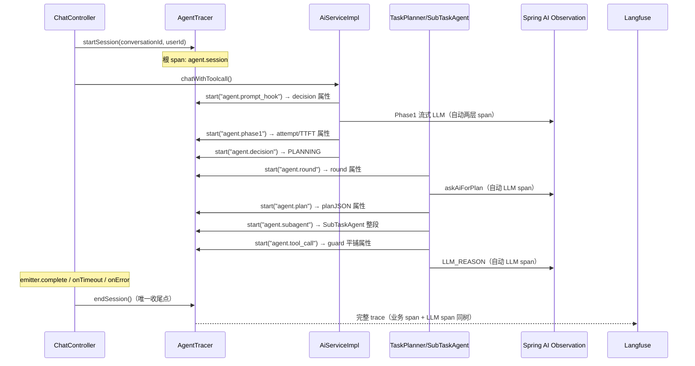

# Agent 全链路观测（Observability）架构设计

> **版本**: v1.1（四视角对抗评审后修订）
> **最后更新**: 2026-08-03
> **技术栈**: Spring AI 1.1.2 内置观测（Micrometer Observation）+ OpenTelemetry GenAI 语义 + 观测后端可插拔（**当前默认 Langfuse 免费云 Hobby**，可插拔架构见 [观测后端解耦改造方案](./观测后端解耦改造方案.md)）
> **对应代码路径**: `picknear/src/main/java/com/hmdp/agent/`（现有链路）、`agent/observability/`（规划新增）
> **相关文档**: [Agent模块架构设计](../Agent模块架构设计.md), [Agent任务队列方案](../Agent任务队列方案.md), [Docker部署指南](../../ops/Docker部署指南.md)

---

## 目录

1. [模块定位](#1-模块定位)
2. [需求与决策汇总](#2-需求与决策汇总)
3. [技术选型：成熟方案调研结论](#3-技术选型成熟方案调研结论)
4. [总体架构](#4-总体架构)
5. [数据模型：Trace / Span 定义](#5-数据模型trace--span-定义)
6. [核心设计](#6-核心设计)
7. [配置说明](#7-配置说明)
8. [埋点清单](#8-埋点清单)
9. [已知风险与对策](#9-已知风险与对策)
10. [实施里程碑](#10-实施里程碑)
11. [项目叙事（找实习定位）](#11-项目叙事找实习定位)
12. [附：文件规划清单](#12-附文件规划清单)

---

## 1. 模块定位

为 Agent 模块提供**全链路可观测能力**：一次 AI 请求从进入 Controller 到 SSE 流结束的完整路径（Phase 1 → Hook 决策 → 子 Agent 规划执行 → 工具调用 → 聚合结论），以**树形 Trace + 指标**的形式呈现，业务语义（护栏投票、规划轮次、工具名）与 LLM 调用细节（token、耗时、费用）同树可见。

### 1.1 解决什么问题

| 现状痛点 | 观测系统目标 |
|---------|-------------|
| 链路跨两个线程池、多阶段，出问题只能 grep 日志拼全貌 | traceId 贯穿，一条会话一棵树 |
| "AI 为什么调了这个工具 / 为什么被 BLOCK" 无迹可寻 | span 记录 Guard 逐策略投票、Hook 决策、规划 JSON |
| LLM token 消耗、费用完全不可见 | 每次 LLM 调用自动记录 usage，成本可统计 |
| 线程池/连接池等基础设施指标缺失 | Actuator 白捡标准指标 |

### 1.2 核心定位

**LLM 调用层观测用成熟方案（Spring AI 内置），业务语义层观测自研（AgentTracer 埋点），展示用观测后端现成 UI（当前默认 Langfuse，可插拔，见 §6.5 注记与 [观测后端解耦改造方案](./观测后端解耦改造方案.md)）。**

> ⚠️ **默认路径提醒**：生产默认走 **SubTaskAgent** 路径（`feature.subagent.enabled=true`），`TaskExecutor` 仅回退路径使用（P5 重整后为回退路径组件，已去 `@Deprecated`，见《Agent模块架构设计》legacy 一节）。业务观测必须覆盖两条路径，缺一不可（见 5.1）。

---

## 2. 需求与决策汇总

（需求收敛过程产物，v1.0 决策基线，v1.1 经四视角对抗评审修订）

| # | 维度 | 决策 |
|---|------|------|
| D1 | 核心用途 | 技术学习 + 找实习的项目展示；定位务实，不包装、不吹 |
| D2 | 技术路线 | 自研业务语义 Trace + Spring AI 内置观测白捡 LLM 层 |
| D3 | 覆盖范围 | 后端 Agent 全链路（SSE + JSON 双模式）+ LLM 调用（token/费用），不含前端埋点（预留协议） |
| D4 | 展示层 | **Langfuse 免费云（Hobby 档）**：现成 UI 显示自研业务 span，本地零部署、零成本（50k units/月 + 30 天保留 + 2 用户，见 6.5） |
| D5 | 数据粒度 | 元数据 + 结果摘要；详情含规划 JSON、Guard 投票明细、重试喂错内容（诊断类属性，见 6.1） |
| D6 | 实时性 | 完成态为主 + 进行中粗状态（"已进入 Phase2 / Round N"） |
| D7 | 指标 | 混合：业务指标自研（Redis 计数 + 每日快照单表）+ 技术指标 Actuator 白捡 |
| D8 | 访问控制 | 公网演示定位：**云版 2 用户硬限制天然限次**——管理员 + 演示访客（Viewer 只读）各占一个名额；演示期外停用访客账号（见 6.5） |
| D9 | LLM 观测深度 | 深度版：token/费用/重试（改造 5 处调用点，已核验无遗漏） |
| D10 | prompt 全文 | **2026-08-09 起默认记录；2026-09-01 key 修正**为 `langfuse.observation.input/output`（原 `gen_ai.request/response.content` 不被 Langfuse OTLP 提取瀑布识别、主字段恒 null，评测取数因此断——详见 §5.2.1 修订注记），经 AttributeSanitizer 脱敏；开关 `hmdp.ai-observability.chat-observation.include-content`（默认 true，可关回"不记"）；`log-prompt`（DEBUG 日志）仍默认 false |
| D11 | 为什么不用 Langfuse Java SDK | ① 数据先落标准 OTel，可同时喂 Jaeger/Grafana/自建面板，不绑厂商；② 协议解耦，SDK 版本不随 Spring AI 升级漂移；③ evals/scoring 现阶段用不上。面试答："SDK 省接入成本，我要的是观测管线的控制权和学习 Observation 本身" |

---

## 3. 技术选型：成熟方案调研结论

### 3.1 能力矩阵（调研于 2026-08-03）

| 方案 | 能力 | 覆盖层 | 取舍 |
|------|------|--------|------|
| **Spring AI 1.x 内置观测**（Micrometer Observation） | ChatClient/ChatModel 自动产生 span + metrics（token/耗时/TTFT/finish_reason）；**spring-ai-alibaba 的 observation autoconfigure 已在 classpath 默认激活** | ✅ LLM 调用层**白捡** | 只需加 bridge/exporter + 配置 |
| **DashScope 适配器观测** | usage 从 `ChatResponse.getMetadata().getUsage()` 获取（流式取末元素，判空兜底） | ✅ 已验证可用 | 调用点从 `.content()` 改为 `.chatResponse()` |
| **OTel GenAI 语义约定** | `gen_ai.*` 标准属性，17 种操作类型（含 `plan`、`execute_tool`、`invoke_agent`） | ✅ 数据出口标准 | 约定仍处 Development 态，需钉版本 |
| **Langfuse 云**（Hobby 免费档） | 现成 UI：trace 树、会话列表、token/成本面板、回放；官方推荐 OTel 路线接入 Spring AI | ✅ 展示层零开发 | 免费额度限制：50k units/月、30 天保留、2 用户（见 6.5） |
| ~~SkyWalking / Jaeger~~ | 通用分布式追踪 | ❌ 不选 | 单服务内无跨服务追踪需求；业务语义看不见 |
| ~~全自研埋点 + 自绘观测页~~ | 完全定制 | ❌ 不选 | 重复造轮子，展示层与 Langfuse 功能重叠 |

### 3.2 为什么自研的是"业务语义"而非"埋点框架"

Spring AI 已替我们埋好 LLM 调用点。成熟框架的盲区是**业务语义**：护栏哪个策略投了 BLOCK、AI 规划了哪几个工具、第几轮哪次工具失败、SSE 首 token 多久到达。自研含金量集中在：**业务 span 建模 + 跨线程传播 + 业务指标**。

### 3.3 Observation 机制速记（理解框架，不是自研成果）

> 以下全部从 micrometer-observation **1.14.5 源码逐行核验**（不是背书）。这些是 Micrometer 的标准行为——理解它是为了用对，**不是简历亮点**；亮点是我们基于这些机制做的设计决策（6.2 时序契约、6.3 显式传播）。

```
Micrometer ObservationRegistry（Boot 自动配置 bean）
  └─ 注册 Handler：TracingObservationHandler（→ OTel span）、MeterObservationHandler（→ 指标）

父子关系在【创建时】固化（源码：三个 createNotStarted 重载都在 contextSupplier.get()
  后立即调用 context.setParentFromCurrentObservation(registry)）：
  → registry.getCurrentObservation() 取当前线程 scope 栈顶为父，仅当父为 null 时
  → SimpleObservation.start() 不设父级，只做 convention + handler 通知（计时起点）

try (Observation.Scope scope = obs.openScope()) { ... }
  → SimpleScope 入线程局部栈；notifyOnScopeOpened → bridge 内 span.makeCurrent()
  → scope 必须 try-with-resources 配对（防线程池串味）

SimpleObservation.stop() 无幂等保护（重复 stop 重复触发 handler）
  → OTel span.end() 在 SDK 层幂等，但 MeterObservationHandler 会重复计数
  → 因此 AgentTracer.endSession 必须自带幂等保护

span 导出链：Tracer（OTel SDK）→ BatchSpanProcessor → OtlpHttpSpanExporter → OTLP → Langfuse
```

**关键结论**：子 span 必须在已 `openScope()` 的线程内**创建**（父级在创建时固化，与 start 时机无关）；只把 Observation 对象传到异步线程而不重新 scope，会静默变孤儿。

**为什么父子在创建时固化、而不是 start 时**（面试追问的标准答案）：父子关系是**逻辑结构**，创建点（哪个线程、哪个作用域）就是决定性的；start() 只决定计时起点。好处：代码可以在 scope 内创建、稍后 start，父子关系不受影响；对 OTel bridge 而言，`TracingObservationHandler.onStart` 才真正创建 OTel span，此时用 context 里已固化的 `parentObservation` 生成 `parentSpanId`。

---

## 4. 总体架构

```
前端 Vue（AiChat.vue 不变；观测入口 = Langfuse UI，按 D8 限次）
        │ HTTP / SSE
        ▼
┌─ picknear (8081) ────────────────────────────────────────────┐
│ ① 观测入口  AgentTracer.startSession(conversationId, userId) │
│    Controller 层创建根 span（agent.session）                  │
│    SSE 收尾：emitter 三回调统一 endSession（唯一收敛点）       │
│        │ openScope() 跨线程显式传播                           │
│ ② 业务语义埋点  AgentTracer API（自研核心）                   │
│    span: prompt_hook / phase1 / decision / round / plan /    │
│          tool_call / subagent / llm_reason / guard / prompt  │
│    属性: 字段注册表 AgentField（key+脱敏级别，见 §5.1）         │
│    （所有属性经 AttributeSanitizer 脱敏出口）                  │
│        │ 同一棵 Observation 树                                │
│ ③ LLM 调用层（Spring AI 内置观测，白捡）                      │
│    5 处调用点改造为取 ChatResponse（usage，判空兜底）          │
│    → gen_ai.* span + metrics 自动嵌套（client 层+model 层）   │
│        │ micrometer-tracing-bridge-otel +                   │
│        │ opentelemetry-exporter-otlp（HTTP/protobuf）        │
└────────┼──────────────────────────────────────────────────────┘
         ▼
┌─ Langfuse 免费云（Hobby 档）───────────────────────────────────┐
│  trace 树形时间线（业务 span + LLM span 同树）                 │
│  会话列表 / token 成本面板 / 回放（配置开关）                   │
│  OTLP 端点: https://jp.cloud.langfuse.com/api/public/otel/v1/traces  │
│  配额：50k units/月、30 天保留、2 用户（天然限次，D8）          │
└───────────────────────────────────────────────────────────────┘
```

### 4.1 数据流（一次 SSE 工具调用请求）



---

## 5. 数据模型：Trace / Span 定义

### 5.1 Span 清单

> **字段真相源（2026-08-11 重构后）**：本表关键属性与代码一一对应，定义收敛在字段注册表 `com.hmdp.agent.observability.model.AgentField`（每个常量编码 `key` + 脱敏级别 + 所属 span 类型）。埋点用 `span.set(AgentField.X, value)`，**改字段名 / 加字段 / 改脱敏级别只改 `AgentField` 一处**，并同步本表。

| Span 名 | 父级 | 位置 | 关键属性（`AgentField` 常量 → 上报 key） |
|---------|------|------|---------|
| `agent.session` | — | ChatController 入口 | `CONVERSATION_ID`→`conversation.id`、`USER_ID`→`user.id`、`FINISH`→`finish`(SSE 收敛点，COMPLETE/TIMEOUT/ERROR) |
| `agent.prompt_hook` | session | PromptHookChain 执行后 | `HOOK_DECISION`→`hook.decision`(PASS/REPLACE/BLOCK)、`HOOK_NAME`→`hook.name` |
| `agent.phase1` | session | Phase 1 流式调用（**stream 消费完毕、hook 执行之前**结束） | `ATTEMPT`→`attempt`、`STREAM_LEN`→`stream_len`、`STATUS`→`status`(FAILED) |
| `agent.decision` | session | AfterAiHookChain 后 | `DECISION`→`decision`(BLOCK/REPLACE/PASS/PLANNING)、`HOOK_NAME`→`hook.name` |
| `agent.round` | session | TaskPlanner 主循环每轮（semantic=轮次号） | `TOOL_COUNT`→`tool_count`、`PLAN_VALID`→`plan_valid` |
| `agent.plan` | round | decompose 校验后 | `VALIDATE_RESULT`→`validate_result`(from_response/ai_plan/empty)、`PLAN_TOOLS`→`plan.tools`(逗号拼接) |
| `agent.subagent` | round | SubTaskAgent.execute 整段（默认路径） | `TOOL_COUNT`→`tool_count`；**逐工具回填已实现**（2026-09，评测 Phase 2）：`TOOL_ENTRY_NAME/STATUS`→`tool.{i}.name/status`（ToolExecutionRecorder + AbstractToolLoop.invokeToolAndRecord 三策略统一接入，见评测设计文档 §6.1） |
| `agent.tool_call` | round | 每个 TOOL_CALL 执行（回退路径） | `STATUS`→`status`(OK/FAILED)、`TOOL_RESULT_SUMMARY`→`tool.result_summary` |
| `agent.llm_reason` | round | 每个 LLM_REASON 执行 | `BASED_ON`→`based_on`(完成/失败工具摘要)、`STATUS`→`status` |
| `agent.guard` | — | GuardedToolCallback 评估（semantic=决策.工具[.模型][.参数摘要]） | `TOOL_NAME`→`tool.name`、`MODEL_NAME`→`model.name`、`TOOL_ARGUMENTS`→`tool.arguments`、`GUARD_POLICY`→`guard.policy` |
| `agent.prompt` | — | DefaultPromptService 模板获取/渲染（semantic=模板键） | `PROMPT_SOURCE`→`prompt.source`(remote/builtin/missing)、`PROMPT_RENDERED_LEN`→`prompt.rendered_len` |

> **动态/拼接 key**：参数化字段（`TOOL_ENTRY_NAME`=`tool.{i}.name`、`GUARD_POLICY_ENTRY`=`guard.policy.{name}`）由 `span.set(field, segment, value)` 填充段得到，满足运行时动态 key 扩展。
>
> **JSON 同步模式**（`chatReturnStringResult`）：同样生成 `agent.session` → `agent.prompt_hook` → `agent.phase1` 父子链（同步路径无 phase2），根 span 在方法返回前 finally 结束。

### 5.2 与 OTel GenAI 语义的对齐

业务 span 命名挂 `agent.*` 前缀避免与 `gen_ai.*` 保留语义冲突；LLM span 由 Spring AI 按 `gen_ai.*` 约定自动生成。**每个 LLM 调用实际有两层自动 span**（`spring.ai.chat.client` 层 + `gen_ai.client.operation` model 层），这是正常结构，不是重复调用。

#### 5.2.1 LLM generation 名按功能区分 + content 补发（2026-08-09 增强，2026-09-01 key 修正）

> **修订注记（2026-09-01，评测取数修复）**：补发 key 从 `gen_ai.request.content`/`gen_ai.response.content` **改为 `langfuse.observation.input/output`**（Langfuse SDK 协议）。原因：Langfuse OTLP 转译的 input/output 提取瀑布（extractInputAndOutput）**不识别 `gen_ai.request/response.content`**——该 key 转译后只进 observation metadata、主字段恒 null；而 observation 级 evaluator（LLM-as-a-judge）从 metadata 取数又实测不可用（jsonSelector 全空），评测链路因此断。`langfuse.observation.input/output` 是提取瀑布 Step 1（最高优先级），转译后**主字段有值**。完整排查见 `md/agent/Agent评测功能交接文档.md` §三。

- **背景**：Spring AI 1.1.2 的 `DefaultChatModelObservationConvention` 只发 usage/参数/finish_reason，**不发 LLM content** → Langfuse generation 的 input/output 恒为 null；且所有 LLM 调用默认同名 `chat <model>`，无法一眼区分各功能。
- **content 补发（key 2026-09-01 修正）**：自定义 convention（`ChatModelObservationConventionConfig`）在 `getHighCardinalityKeyValues` 补发 `langfuse.observation.input`（请求侧序列化消息数组，含 tool 结果 / 工具调用，经 `AttributeSanitizer` 脱敏 + 截断）与 `langfuse.observation.output`（回复文本；TOOL_CALLS 响应序列化为 `[调用工具] name(args)`，2026-09-02 补充）。开关 `hmdp.ai-observability.chat-observation.include-content`（默认 true）。序列化/脱敏逻辑抽为 `ChatContentSerializer`（observability/support，纯静态可独立单测）。
- **功能命名**：各 LLM 调用点用 `mark("<功能>")` 打标（try/finally 清理），generation 名 = `{功能}-chat <model>`：`phase1-chat`（JSON+SSE Phase1）、`planner-chat`（子任务规划）、`subagent-exec-chat`（子代理工具循环）、`subagent-compress-chat`（工具结果压缩）、`llm-reason-chat`（回退路径聚合）。
- ⚠️ **已知限制**：SSE 流式 Phase1 的模型层观察在 Reactor 线程创建/命名，ThreadLocal 标记跨不过去，暂仍为 `chat`（同步调用均正常）。

### 5.3 存储、保留与合规

- 全量数据存 Langfuse 免费云，**保留期 30 天由云版固定提供**（Hobby 不支持自定义保留策略，超期自动清理）
- 合规兜底：按 userId 删除走 Langfuse API（Hobby 限 50 req/day，演示量级远低于此）
- 业务指标每日快照存 MySQL `ai_metric_daily`（见 6.4）
- 合规口径：默认只留统计字段与脱敏摘要；M4 详情增强（Guard 投票/规划 JSON）默认关闭、按需开启

---

## 6. 核心设计

### 6.1 AgentTracer 埋点 API（自研核心）

轻量门面，内部基于 Micrometer `Observation` 实现。**API 以 micrometer 1.14.5（Boot 3.4.4 BOM 托管）实测为准**：

```java
// 会话入口（Controller 层，主线程）
agentTracer.startSession(conversationId, userId);   // 创建根 span

// 任意阶段埋点（try-with-resources 自动结束；字段注册表 2026-08-11 重构后形态）
try (AgentSpan span = agentTracer.start(AgentSpanSpec.TOOL_CALL, toolName)) {
    String result = callback.call(args, ctx);
    span.set(AgentField.TOOL_RESULT_SUMMARY, result);   // key + 脱敏级别都由 AgentField 决定
    span.set(AgentField.STATUS, "OK");
}   // 结束即上报：耗时/状态

// 内部实现（注意 API 形态：经 SpanLifecycle 封装，先 start 后 openScope 的断链契约见 AgentTracer）
Observation obs = lifecycle.create(name);
obs.start();                                            // 必须先 start
try (Observation.Scope scope = lifecycle.openScope(obs)) {   // 再 openScope
    ...  // 子 span（含 LLM span）必须在 scope 内"创建"——父级在创建时捕获
}
obs.stop();
```

设计约束：

| 约束 | 原因 |
|------|------|
| 埋点 Fail-Open | 埋点自身异常吞掉并告警日志，不影响主链路（对齐 Hook 链先例） |
| **两类属性（字段注册表定级）**：`SanitizeLevel.SUMMARY` 摘要类截断 200 字符；`DIAGNOSTIC` 诊断类（guard 投票明细等大字段）独立上限 4KB | 避免"截断违反 D5"与"体积爆炸"两难 |
| **统一脱敏出口 `AttributeSanitizer`** | 所有属性经 sanitize 过滤：手机号 `1[3-9]\d{9}→138****8000`、邮箱、身份证脱敏；`tool.result_summary` 摘要提取（仅数量/状态），博客正文不进属性 |
| 同名 span 允许嵌套 | 每轮 Round 名称相同，靠属性 `round` 区分 |
| **span 名编码业务语义**（M1.5 实测 2026-08-03）| Langfuse 4.2.0 JP 云版 OTLP 转译**不展示自定义 attributes**（官方文档称应落 `metadata.attributes`，实测不一致）→ 关键业务语义写进 span 名：`agent.{类型}.{语义}`（如 `agent.tool_call.queryShop`、`agent.guard.BLOCK.deleteBlog`）；属性仍全量写入（M2.5 断言 + 未来兼容），类型统计用前缀匹配不受语义后缀影响 |

### 6.2 跨线程传播（本方案的核心技术难点）

链路跨两个线程池（`aiTaskExecutor` / `subtaskExecutor`），ThreadLocal 天然丢失。**对齐 `ToolContext` 显式传递的先例**：

```
主线程（Controller）：  startSession() 创建根 Observation
                        ↓ ChatContext 携带根引用
异步线程（aiTaskExecutor）：
                        runAsync 内 try (root.openScope()) → start("agent.phase1") 等
异步线程（subtaskExecutor）：
                        planAndExecuteAsync 增加显式 Observation 入参
                        → 入口 openScope()，主循环多轮串行不断链
快照恢复（resumeFromSnapshot）：
                        ⚠️ 现代码传 ctx=null（TaskPlanner.java:511-515）→ 必须改为
                        由调用方传入根 Observation，或 TaskSnapshot 存 conversationId
                        + AgentTracer 按会话关联重新 startSession
```

要点：
- 传播载体**显式参数传递**（Observation 随 ChatContext / 方法入参流动），不依赖 ThreadLocal
- **根 span 结束唯一收敛点**：ChatController 对 emitter 注册 `onCompletion/onTimeout/onError` 三回调统一 `endSession()`（`emitter.complete()` 散落 6 处不可行：AiServiceImpl:124/169、AiResponseRouter:60/65/76/84、TaskPlanner:75/79）；OTel 允许 span 在任意线程 stop，容器回调线程里结束合法
- JSON 同步模式：`chatReturnStringResult` 返回前 finally 结束根 span

#### 根 span 生命周期时序契约（防偶发断链的显式保证）

基于源码确认的机制（父级创建时固化 / stop 无幂等），定义五条契约，实现与测试都以此为准：

| # | 契约 | 依据 |
|---|------|------|
| T1 | **创建时机**：子 span 必须在其父 span 的 scope **已 open 的线程内创建**；不要求 scope 覆盖子 span 运行期，只要求覆盖创建点 | 父级在创建时固化（3.3） |
| T2 | **scope 配对**：每个线程边界的 `openScope()/close()` 必须 try-with-resources 配对；scope 生命周期必须覆盖其内所有子 span 的创建点 | SimpleScope 线程局部栈；scope 未关时晚到子 span 仍能挂到已 stop 的父上（parent 引用有效） |
| T3 | **endSession 幂等**：AgentTracer 内部状态位保护，重复调用只 stop 一次 | `SimpleObservation.stop()` 无幂等保护，重复 stop 会让 meter handler 重复计数 |
| T4 | **正常路径时序天然成立**：onCompletion 由 `emitter.complete()` 触发，晚于 TaskPlanner 主循环结束 → 子 span 先 stop、根 span 后 stop，导出顺序正确（Langfuse 按 trace_id 重组） | 代码流：TaskPlanner 完成 → complete → 回调 |
| T5 | **异常路径（timeout/error）策略**：根 span 先 stop（标记 `finish=TIMEOUT/ERROR`），允许晚到子 span 挂靠——只要其 scope 未关；scope 关闭后创建的 span 视为孤儿（仅 WARN 日志），**由集成测试锁定此场景**，不让它成为偶发 | 根 stop 不强制关闭已开的 scope；scope 关后 `getCurrentObservation()` 取不到父 |

> T5 是刻意的设计选择：不做"引用计数等所有异步任务完成再 stop"（复杂度不值，且 30min 超时场景等不到）——用"标记 + 允许挂靠 + 测试锁定"替代。

### 6.3 LLM 调用点改造（token / usage）

5 处调用点从 `.content()` 改为取 `ChatResponse`（已全库核验无遗漏）：`AiServiceImpl.java:78`（同步 Phase1）、`AiServiceImpl.java:140`（SSE 流式 Phase1）、`TaskPlanner.java:290`（askAiForPlan）、`TaskExecutor.java:107`（LLM_REASON）、`SubTaskAgent.java:161`（子 Agent）。

**流式场景**（`AiServiceImpl.java:140`，实测要点：末 chunk 常为纯 usage chunk，text 为 null）：

```java
for (ChatResponse r : prompt.stream().chatResponse().toIterable()) {
    String t = r.getResult() != null && r.getResult().getOutput() != null
            ? r.getResult().getOutput().getText() : null;
    if (t != null && !t.isEmpty()) { buffer.append(t); SseUtils.safeSend(emitter, SseUtils.escapeJson(t)); }
    Usage u = r.getMetadata() != null ? r.getMetadata().getUsage() : null;
    if (u != null) lastUsage = u;   // 末元素取 usage，判空兜底
}
```

> usage 可能为 null（个别模型/流中断）→ 一律判空；缺失时标记 `usage_estimated=true`，不计入成本汇总。

### 6.4 指标体系（混合，务实版）

**白捡（Actuator）**：`gen_ai.client.operation.duration`、`gen_ai.client.operation.active`、`gen_ai.client.token.usage`、`spring.ai.chat.client.*`、线程池/连接池指标（`/actuator/prometheus`，需 `micrometer-registry-prometheus` 依赖）。

**自研业务指标**（`AgentMetrics`）：Redis 实时计数器（Guard 命中按策略、工具调用/失败按工具、决策分布、token 累计）+ **@Scheduled 每日快照落 MySQL 单表 `ai_metric_daily`**（砍掉 v1.0 的 hourly 表与汇总任务——Langfuse 已有成本面板，避免重复建设）。注意：单实例部署约束（双实例会双写）；采样降为 0.1 后指标仍全量计数，口径差异需在查询时注明"指标全量用于监控，trace 抽样用于排查，职责不同"。

### 6.5 观测后端接入（当前默认：Langfuse 免费云 Hobby 档）

> **可插拔说明（2026-08-15）**：本节描述的是**默认后端 = Langfuse** 的接入细节。数据链路为标准 OTLP 协议、业务埋点层只依赖 Micrometer Observation，展示端可按 [观测后端解耦改造方案](./观测后端解耦改造方案.md) 切换为 Jaeger / SigNoz / Tempo / 自建 OTLP 后端（改 `management.otlp.tracing.endpoint` 与行为开关即可），本文档不随默认后端修改。以下配额/保留期/账号口径均指 Langfuse Hobby 档。

**部署形态**：全部在 Langfuse 云上，**本地零组件、零成本**。免费档（Hobby）官方限制（以 langfuse.com 官方页为准，2026-08 核对）：

| 限制项 | 数值 | 对我们的影响 |
|--------|------|-------------|
| 配额 | **50,000 units/月**（1 unit = 1 个 trace/observation/score） | 约 20 units/请求 → 全量 ≈2500 请求/月；采样 0.1 → ≈25000 请求/月（演示期足够） |
| 数据保留 | **30 天**（Hobby 不支持自定义保留策略，自动清理） | 对齐 5.3 的 30 天口径，无需自建 TTL |
| 用户数 | **2 个（硬限制）** | 天然限次（D8）：管理员 + 演示访客各占一个名额 |
| 摄取限流 | 1000 req/min（OTLP/ingestion） | 演示量级不可达 |
| 删除 API | 50 req/day | 合规兜底删除在此配额内执行 |
| 区域 | US / EU / JP 可选；无需信用卡 | **已注册 JP 区域**（`jp.cloud.langfuse.com`，相对国内延迟更友好），M0 实测可达性 |

**访问控制（公网演示定位，D8）——2 用户硬限制即"限次"**：

- **管理员账号**：演示者本人，"特定用户"，不受限
- **演示访客**：占第 2 个名额，配 **Viewer（只读）角色**——只可看 trace，不可改配置/删数据
- **演示开关**：演示日开放访客账号，演示后停用/改密（云上无 Nginx 可配，用"账号开关"实现限次；若 Hobby 不支持 Viewer 角色，则访客账号演示后即停用）
- 数据导出（OTLP）与应用是出站单向推送，不额外暴露任何内网端口

**接入配置**（Boot 3.4 原生属性优先，凭据走环境变量）：

```yaml
management:
  otlp:
    tracing:
      endpoint: ${LANGFUSE_BASE_URL}/api/public/otel/v1/traces   # 实际: https://jp.cloud.langfuse.com/api/public/otel/v1/traces（实测必须带 /v1/traces，见 Langfuse云接入说明.md §4）
      headers:
        Authorization: Basic ${LANGFUSE_BASIC_AUTH}   # base64(pk-xxx:sk-xxx)，.env + gitignore
  tracing:
    sampling:
      probability: 1.0
```

- 云版永远是最新版本：OTLP 端点门槛（≥3.22）与 OTel 路线门槛（≥3.63）**自动满足**
- 加请求头 `x-langfuse-ingestion-version: 4` 切实时摄取（v3 默认批量约 5s 延迟）——验收时"看不到 span"先查这个，别误判为埋点 bug
- 仅支持 HTTP/protobuf（不用 gRPC）；只收 trace，日志/metric 的 404 导出日志可忽略
- 用户/会话关联：根 span 属性带 `langfuse.user.id`、`langfuse.session.id`
- **数据出站提示**：脱敏摘要会上传第三方云（EU/US 区域）——AttributeSanitizer（6.1）从"重要"升级为**必须**；演示日浏览器直连云 UI，先测网络可达性

### 6.6 采样与保留策略

| 场景 | 采样率 | 理由 |
|------|--------|------|
| 日常开发/演示 | 0.1–0.2 | 控制云配额消耗（50k units/月）；配合指标全量计数 |
| 压测/演示日 | 1.0 全量 | 需要完整回放时临时开启 |

保留：云版 30 天自动清理；`ai_metric_daily` 保留 90 天。

### 6.7 观测系统自身故障与容量模型

- **导出故障**：OTLP `BatchSpanProcessor` 异步导出（默认 queue 2048/batch 512/timeout 30s），**Langfuse 宕机只丢 span 不影响业务线程**；可设 `maxQueueSize` 上限，导出失败丢弃并计数告警
- **开销量级**：约 20 span/请求（9 处业务 + 双层 LLM），序列化 <1ms/请求，相对 LLM 秒级调用可忽略
- **trace 体积**：plan_json（≤4KB）+ 摘要类（≤200B）约束下单 trace <10KB；全量采样日量级：假设 100 请求/日 ≈ 1MB/日，云保留 30 天 ≈ 30MB
- **云配额预算**（Hobby 50k units/月，2026-08-03 实测修正）：**任务类 span 已由观测白名单过滤**（见 §7），不再计入；LLM 调用 Langfuse 转译折叠后 2-3 units/调用（GENERATION+HTTP），5 处调用 ≈10-15 units + 业务 9-11 + 根 1 → **约 20-27 units/请求** → **全量采样 ≈1900-2500 请求/月**（≈65-83 请求/天，演示期足够）；采样 0.1 时 ≈1.9-2.5 万请求/月；摄取限流 1000 req/min 不可达

---

## 7. 配置说明

```yaml
spring:
  ai:
    chat:
      observations:              # ⚠️ 键在此层级（spring.ai.dashscope.observations.* 不存在）
        log-prompt: false        # DEBUG 日志开关：仅控制控制台日志，不产生 OTel 属性
        log-completion: false
management:
  otlp:
    tracing:
      endpoint: ${LANGFUSE_BASE_URL}/api/public/otel/v1/traces   # 实际: https://jp.cloud.langfuse.com/api/public/otel/v1/traces（实测必须带 /v1/traces，见 Langfuse云接入说明.md §4）
      headers:
        Authorization: Basic ${LANGFUSE_BASIC_AUTH}    # base64(pk:sk)，见 Langfuse云接入说明.md §4
  tracing:
    sampling:
      probability: 0.1           # 日常采样；压测/演示日临时改 1.0
  endpoints:
    web:
      exposure:
        include: health,metrics,prometheus    # 公网部署只暴露 health（见 9）
hmdp:
  ai-observability:
    trace-enabled: true          # 业务埋点总开关（false 时 AgentTracer 空转）
    summary-max-chars: 200       # 摘要类属性截断
    diagnostic-max-chars: 4096   # 诊断类属性上限（plan_json 等）
    chat-observation:
      include-content: true      # LLM 请求/回复全文写入 langfuse.observation.input/output（2026-09-01 key 修正，Langfuse 转译后落主字段 input/output），经脱敏
    metric:
      pricing:                   # token 单价（元/千 token）
        qwen-plus: { input: 0.0008, output: 0.002 }   # ⚠️ 仅 0-128K 段，2025-09 起阶梯计价，误差 ±30%，口径"数量级估算"
```

新增依赖（pom，**全部不写版本，走 Boot 3.4.4 BOM**——Boot 管理 micrometer 1.14.5 / micrometer-tracing 1.4.4 / opentelemetry 1.43.0，与容器既有 otel-api 1.43.0 一致；手工钉版本会与 bridge 产生 API 漂移）：

```xml
micrometer-tracing-bridge-otel
opentelemetry-exporter-otlp
micrometer-registry-prometheus   <!-- 缺它 /actuator/prometheus 404 -->
```

---

## 8. 埋点清单

（实现时的落地依据，M2 里程碑逐条核销）

| 文件 | 埋点位置 | Span | 关键属性 |
|------|---------|------|---------|
| `agent/controller/ChatController.java` | 入口 | `agent.session` | conversation.id、user.id |
| `agent/stream/ObservedSseEmitter.java` | 三回调收敛点 | 根 span（agent.session）写 `finish` | finish(COMPLETE/TIMEOUT/ERROR) |
| `agent/service/impl/AiServiceImpl.java` | 同步模式（chatReturnStringResult）| session→prompt_hook→phase1 链 | 同 SSE 语义 |
| `agent/service/impl/AiServiceImpl.java` | PromptHookChain 执行后 | `agent.prompt_hook` | hook.decision、hook.name |
| `agent/service/impl/AiServiceImpl.java` | Phase1 循环（stream 消费完、hook 前结束） | `agent.phase1` | attempt、stream_len、status(FAILED) |
| `agent/service/impl/AiServiceImpl.java` | AfterAiHookChain 后 | `agent.decision` | decision、hook.name |
| `agent/task/TaskPlanner.java` | 主循环每轮 | `agent.round` | tool_count、plan_valid |
| `agent/task/TaskPlanner.java` | decompose 校验后 | `agent.plan` | validate_result、plan.tools |
| `agent/task/TaskPlanner.java` | SubTaskAgent.execute 段 | `agent.subagent` | tool_count + tool.{i}.name/status 逐工具回填（ToolExecutionRecorder，2026-09 已实现，见 §5.1 表） |
| `agent/task/TaskExecutor.java` | TOOL_CALL / LLM_REASON（回退路径） | `agent.tool_call` / `agent.llm_reason` | status、tool.result_summary / based_on |
| `agent/guard/GuardedToolCallback.java` | 评估后 | `agent.guard`（semantic 编码 决策.工具[.模型][.参数摘要]，决策小步在 ToolGuardGate） | tool.name、model.name、tool.arguments、guard.policy |
| `agent/prompt/impl/DefaultPromptService.java` | 模板获取/渲染 | `agent.prompt`（semantic=模板键） | prompt.source、prompt.rendered_len |

---

## 9. 已知风险与对策

| 风险 | 对策 |
|------|------|
| 云配额超限（50k units/月） | 预算换算见 6.7：全量 ≈2500 请求/月；演示日按需临时降采样；超限表现与重置机制 M0 注册时确认 |
| **数据出站第三方云**（脱敏摘要上传 EU/US 区域） | AttributeSanitizer 为**必须项**（6.1）；演示日浏览器直连云 UI 需先测网络可达性（国内访问可能慢） |
| 云保留 30 天固定 + 删除限流 50 req/day | 依赖云版自动清理；合规兜底删除在配额内执行（5.3） |
| 2 用户硬限制 | 正好适配 D8：管理员 + 演示访客（Viewer）；演示后停用访客（6.5） |
| **API 用错编译不过 / 静默断链**（v1.0 文档 `scoped()`、两参 `createNotStarted` 均不存在） | 以 6.1 实测 API 为准；父级捕获在"创建时"，子 span 必须在 scope 内创建 |
| 快照恢复路径断链（resumeFromSnapshot 传 ctx=null） | 显式 Observation 入参 / TaskSnapshot 存 conversationId 重关联（6.2） |
| 根 span 悬挂（complete() 散落 6 处） | ChatController 三回调统一 endSession（唯一收敛点） |
| **endSession 非幂等 / scope 生命周期越界**（重复 stop 导致 meter 重复计数；scope 关后创建 span 变孤儿） | 时序契约 T1–T5（6.2）：endSession 状态位幂等；scope 与子 span 创建点配对；异常路径"标记+允许挂靠+测试锁定" |
| **公网演示暴露** | 云版 2 用户硬限制 + Viewer 只读 + 演示后停用访客（6.5）；Actuator 公网只透传 health，不透传 /actuator |
| 跨线程 span 断链 | 显式 openScope() 传播（6.2），M2.5 集成测试断言父子关系 |
| **脱敏不足**（截断≠脱敏：手机号/博客正文/SQL 会进 Langfuse） | AttributeSanitizer 统一出口（6.1）；公网演示前必验 |
| **Langfuse 不展示自定义属性**（M1.5 实测：4.2.0 JP 云版 OTLP 转译丢 attributes，含 langfuse.* 前缀） | span 名编码关键语义（6.1）；属性照常全量写入（本地/未来兼容）；已记录 Langfuse云接入说明.md §5.6 |
| 采样降 0.1 后指标口径差异 | 指标全量（监控）与 trace 抽样（排查）职责分离，查询注明（6.4） |
| Langfuse 版本门槛与批量摄取延迟 | 云版永远最新，门槛自动满足；加 `x-langfuse-ingestion-version: 4` 头；验收先查摄取延迟（约 5s） |
| OTel GenAI 语义约定未稳定（2026-05 迁独立仓库，无 tag） | 依赖全部走 Boot BOM 不手工钉版本；升级时先核对属性名 |

---

## 10. 实施里程碑

| 阶段 | 内容 | 产出/验证 |
|------|------|-----------|
| **M0 云配额评估** | 注册 Langfuse 云账号（选区域）+ 确认超限表现/重置机制 + 网络可达性测试 + units 预算换算（6.7） | 配额预算表 + API keys 入 `.env`（gitignore） |
| **M1 基础设施打通** | 加依赖（3 个，不钉版本，**已入 pom**）+ Langfuse 云接入（API keys 已入 .env）+ 5 处调用点改造 | **先跑 `LangfuseSmokeTest` 冒烟验证**（文件已就位，见 Langfuse云接入说明.md §5），Langfuse 可见 LLM span（**预期每调用两层**：client 层+model 层）再正式埋点 |
| **M2 自研业务埋点** | AgentTracer + 11 处埋点 + 跨线程传播 + Controller 收尾 | 完整会话树（session → phase1 → round → subagent/tool_call） |
| **M2.5 验证（自研最硬证据）** | InMemorySpanExporter 集成测试：①根 span 存在 ②异步线程内 LLM span 的 parent 是 `agent.phase1`/`agent.round` ③流式 usage 落在末元素 ④超时/异常路径 `finish=ERROR` ⑤快照恢复不断链 ⑥**时序契约**：重复 endSession 只 stop 一次（meter 不重复计数）、scope 关闭后创建的 span 记为孤儿并 WARN | 测试代码即"自研"证据，面试直接展示；⑥锁定 T3/T5，杜绝偶发断链 |
| **M3 指标** | AgentMetrics（Redis 计数 + daily 快照）+ prometheus registry + 成本估算 | /actuator/prometheus 有 gen_ai.* 与业务指标 |
| **M4 详情增强与反哺** | Guard 投票平铺、plan.tools[]、脱敏验证；**观测反哺记录**：记录真实发现（预期素材：Phase1 重试把完整错误喂回 prompt → 重试 token 膨胀；LLM_REASON 每轮重发历史摘要 → 可优化） | "我通过观测发现并修掉了一个 token 浪费问题"——数据反哺是观测的最终价值 |
| **M5 文档沉淀** | 部署指南、资源预算、架构文档回写 | 本目录系列文档完备 |

---

## 11. 项目叙事（找实习定位：务实，不吹）

> **一句话**：调研 Langfuse / OTel 等成熟方案后，复用 Spring AI 内置观测拿 LLM 调用数据（token/耗时），自研了业务语义埋点（护栏投票、规划轮次、工具调用）与跨线程传播，接入 Langfuse 免费云展示（零成本）。

**叙事原则（找实习）**：

1. **诚实定位**：方案是"调研 → 选型 → 动手实现"，不是"设计企业级可观测平台"。面试官能区分，包装反而减分
2. **突出学习过程**：讲清楚"先想到做高级日志 → 调研发现 Spring AI 已内置 LLM 观测 → 重新划定自研边界（业务语义层）"这条思考线，比结果更值钱
3. **主动承认取舍**：展示层用 Langfuse 是因为自绘页工作量大且功能重叠——"这是省力的正确选择"
4. **数据反哺**：讲"观测发现了什么、改了什么"，比讲"搭了个系统"高一个层次

**可能被追问的问题（提前准备，回答基调=理解原理）**：

1. **跨线程传播怎么做的？** 显式 Observation 引用随 ChatContext 传递 + openScope() 作用域，与不用 UserHolder 而用 ToolContext 同一模式。**亮点是我们自己的设计决策**：三回调统一收尾 + endSession 幂等 + 时序契约 T1–T5（6.2），不是框架行为本身
2. **为什么用 Langfuse 而不是自绘 / 不用官方 SDK？** 见 D11：成熟领域不重复造轮子，但数据走标准 OTel 不绑厂商；自研价值在业务语义层
3. **为什么不用 SkyWalking？** 单服务内无跨服务追踪；业务语义它看不见
4. **采样策略？** 日常 0.1 头部采样（会话整体完整），压测/演示 1.0；指标全量与 trace 抽样职责分离
5. **成本怎么算？** token 从 ChatResponse usage 拿，单价配置化按天汇总；知道阶梯计价，口径是"数量级估算 ±30%"
6. **（实习必问）观测系统里你实际写了多少？** LLM 层是 Spring AI 提供的，我做了 AgentTracer 业务埋点、跨线程传播、快照恢复断链修复、指标统计和 Langfuse 接入——能逐行讲清楚自己写的部分
7. **怎么验证你的埋点是对的？** M2.5 集成测试：InMemorySpanExporter 断言父子关系、流式 usage 落点、异常路径 finish、重复 endSession 幂等、scope 关闭后孤儿场景——直接甩测试代码
8. **（深度追问）父级为什么在创建时捕获，而不是 start 时？** 父子是逻辑结构，创建点（哪个线程、哪个作用域）是决定性的，与计时起点解耦；OTel bridge 在 onStart 时才建 span，用已固化的 parentObservation 生成 parentSpanId。能讲清这个，说明不是背的

---

## 12. 附：文件规划清单

（M1-M2 落地的目标文件结构）

```
src/main/java/com/hmdp/agent/observability/
├── AgentTracer.java            # 门面：startSession/start/end/attribute（内部 Micrometer Observation）
├── AgentSpan.java              # span 句柄（AutoCloseable）
├── AttributeSanitizer.java     # 统一脱敏出口（手机号/邮箱/身份证/白名单字段）
├── AgentMetrics.java           # 业务指标：Redis 计数器 + daily 快照
├── TraceProperties.java        # hmdp.ai-observability 配置
└── (M2.5) AgentTracerIntegrationTest.java   # InMemorySpanExporter 父子关系断言
md/agent/observability/
├── Agent全链路观测架构设计.md   # 本文档
├── Langfuse云接入说明.md       # ✅ 已创建（账号/凭据/依赖/配置/冒烟测试/排查清单/演示开关）
└── (实施过程同步回写变更)
```
