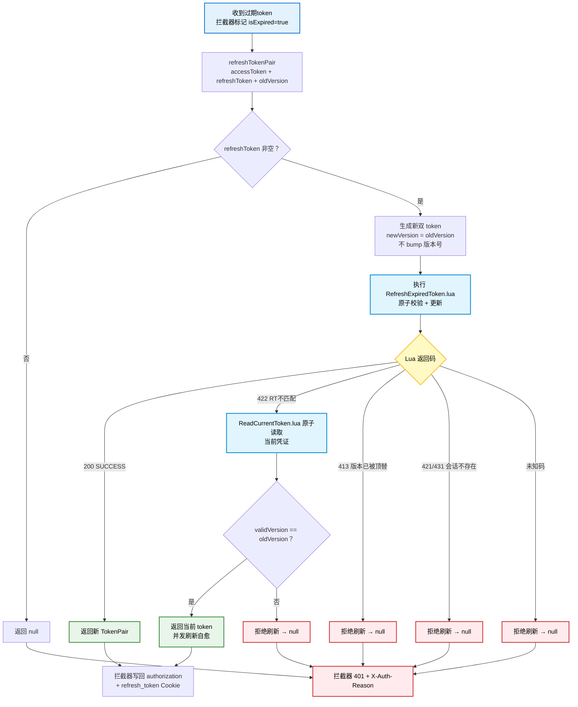

# 过期 Token 刷新流程

> 2026-08-05 更新：`refreshTokenPair` 改为 Lua 原子刷新（复用 `RefreshExpiredToken.lua`），
> `newVersion = oldVersion`（版本号不 bump，版本一致性由 Lua 守卫保证）；
> 新增 422 并发容错（`ReadCurrentToken.lua` 原子读取当前凭证，内含版本守卫）。

## 关键点

- **版本不 bump**：刷新只是"滑动续期"，`newVersion = oldVersion`；登录/换设备才会 `redisIdWorker.nextVersion()` 抬高版本号。
- **版本守卫**：Lua 第 2 步 `orginVersion > version` 返回 413——比当前有效版本还旧的 token 一律拒绝，防止旧会话用已顶替的凭证续期。
- **422 并发自愈**：同一会话并发刷新导致 RT 不匹配时，`ReadCurrentToken.lua` 只在 `validVersion == oldVersion`（仍是同一会话）时返回当前凭证，不会把**新登录**的凭证泄露给旧会话。
- **失败统一 401**：`refreshTokenPair` 返回 `null` 时拦截器置 401 并透传 `X-Auth-Reason: superseded | no-session`，前端据此区分提示文案。
