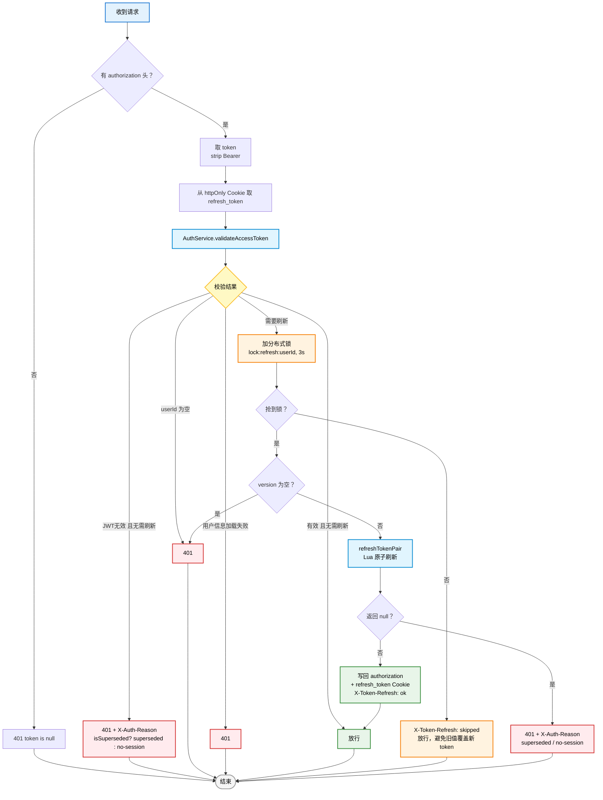

# RefreshTokenInterceptor 拦截流程

> 2026-08-05 更新：刷新统一委托 `AuthService.refreshTokenPair`；401 时透传
> `X-Auth-Reason: superseded | no-session`（区分"账号已在其他设备登录"与"登录已过期"）；
> 刷新锁被占用时跳过刷新放行（`X-Token-Refresh: skipped`）。

## 关键点

- **401 语义统一**：`X-Auth-Reason` 只在两条路径透传——① `validateAccessToken` 返回"无效且无需刷新"（含未过期被顶替）；② `refreshTokenPair` 返回 `null`。`isSuperseded` 读 Redis `validVersion > token.version` 判定。
- **刷新锁**：同一用户并发只允许一个刷新请求执行（3s 锁），抢锁失败者不阻塞、直接放行（前端已有单飞重试，刷新由并发请求完成）。
- **Refresh Token 走 Cookie**：httpOnly `refresh_token` Cookie，JS 不可读；刷新成功由后端 Set-Cookie 覆盖。
- **前端配合**：`request.ts` 收到 401 后单飞重试（若另一请求已刷新则用新 token 重发）→ 单飞登出（读 `X-Auth-Reason`，`superseded` 提示"账号已在其他设备登录"）。
